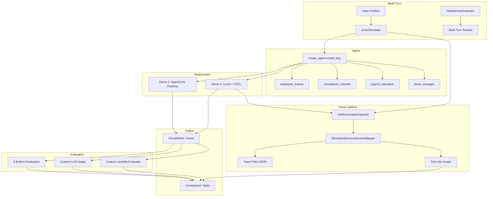

# Design Document

## Overview

Lean EDD POC: a Strands agent with 4 tools, deployed two ways (AgentCore Runtime + local OTEL), evaluated by 8 evaluators (6 built-in + 2 custom), compared across 3 models. Full agent traces are captured in-memory using InMemorySpanExporter and mapped to structured sessions for inspection. Multi-turn conversations are evaluated using ActorSimulator with HR-specific personas. Serverless, minimal code, readable in 30 minutes.

## Architecture



## Project Structure

```
edd-poc/
├── agents/
│   ├── agent.py              # 4 tools + create_agent() factory
│   ├── runtime_agent.py      # AgentCore Runtime entry point
│   └── local_runner.py       # CLI runner with OTEL
├── evaluators/
│   ├── domain_accuracy_config.json  # LLM judge config
│   └── lambda_evaluator.py          # Deterministic checks
├── scripts/
│   ├── run_and_compare.py    # Run all models + compare + trace capture
│   └── run_multi_turn.py     # Multi-turn evaluation with ActorSimulator
├── results/
│   ├── comparison.md         # Generated output with tool use summary
│   ├── multi_turn_comparison.md  # Multi-turn evaluation results
│   └── traces/               # Per-model per-prompt trace files
│       ├── sonnet_prompt_1.json
│       ├── haiku_prompt_1.json
│       ├── nova_pro_prompt_1.json
│       └── tool_use_graph.md # Tool call sequence visualization
└── README.md
```

## Components

### 1. Agent Factory (`agents/agent.py`)

```python
SUPPORTED_MODELS = {
    "sonnet": "us.anthropic.claude-sonnet-4-20250514-v1:0",
    "haiku": "us.anthropic.claude-3-5-haiku-20241022-v1:0",
    "nova_pro": "us.amazon.nova-pro-v1:0",
}

def create_agent(model_key: str) -> Agent:
    """Returns a Strands Agent with 4 tools configured for the given model."""
```

4 tools with mock data. Each tool is a `@tool`-decorated function returning a dict.

### 2. Runtime Agent (`agents/runtime_agent.py`)

Thin wrapper exposing the `agentcore deploy` entry point. Imports `create_agent`, handles the Runtime invocation contract.

### 3. Local Runner (`agents/local_runner.py`)

```bash
python agents/local_runner.py --model sonnet --prompt "What is employee 12345 status in Singapore?"
```

Sets OTEL env vars, creates agent, runs single prompt, exits. No interactive loop.

### 4. Custom LLM Judge (`evaluators/domain_accuracy_config.json`)

JSON config for `agentcore eval evaluator create`. Scores on factual accuracy, completeness, compliance safety. 5-level scale (0.0–1.0).

### 5. Lambda Evaluator (`evaluators/lambda_evaluator.py`)

```python
def lambda_handler(event, context):
    checks = [tool_usage, no_empty_params, has_response, under_latency]
    score = sum(1 for c in checks if c) / 4
    return {"score": score, "details": {...}}
```

### 6. Comparison Script (`scripts/run_and_compare.py`)

Single script that:
1. Sets up InMemorySpanExporter and OTEL telemetry for trace capture
2. Runs 5 prompts against each of 3 models (via local runner)
3. After each invocation, maps spans to structured sessions using StrandsInMemorySessionMapper
4. Saves per-model per-prompt trace files to `results/traces/`
5. Generates tool use graph showing call sequences per prompt
6. Calls `agentcore eval run` with all 8 evaluators
7. Prints comparison table + saves `results/comparison.md` with tool use summary

### 7. Trace Capture and Tool Use Graph (Requirement 8)

The comparison script captures full agent traces in-memory using OpenTelemetry's InMemorySpanExporter, avoiding the need for external collectors or CloudWatch round-trips for trace inspection.

#### Trace Capture Setup

```python
from opentelemetry.sdk.trace.export import BatchSpanProcessor
from opentelemetry.sdk.trace.export.in_memory_span_exporter import InMemorySpanExporter
from strands_evals.telemetry import StrandsEvalsTelemetry
from strands_evals.mappers import StrandsInMemorySessionMapper

# Setup telemetry with in-memory exporter
telemetry = StrandsEvalsTelemetry()
memory_exporter = InMemorySpanExporter()
span_processor = BatchSpanProcessor(memory_exporter)
telemetry.tracer_provider.add_span_processor(span_processor)

# After each agent invocation
spans = list(memory_exporter.get_finished_spans())
mapper = StrandsInMemorySessionMapper()
session = mapper.map_to_session(spans, session_id=f"{model_key}-prompt-{idx}")

# Clear spans for next invocation
memory_exporter.clear()
```

#### Trace File Format

Each trace file (`results/traces/{model_key}_prompt_{idx}.json`) contains:

```json
{
  "session_id": "sonnet-prompt-1",
  "model": "us.anthropic.claude-sonnet-4-20250514-v1:0",
  "prompt": "What is the employment status of employee EMP-12345 in Singapore?",
  "spans": [
    {
      "name": "agent.invoke",
      "start_time": "2025-01-15T10:00:00Z",
      "end_time": "2025-01-15T10:00:02Z",
      "children": [
        {
          "name": "model.call",
          "attributes": {"model_id": "...", "input_tokens": 150, "output_tokens": 80}
        },
        {
          "name": "tool.employee_lookup",
          "attributes": {"employee_id": "EMP-12345", "country": "Singapore"},
          "response": {"employment_status": "active", "department": "Engineering", ...}
        },
        {
          "name": "model.call",
          "attributes": {"model_id": "...", "input_tokens": 300, "output_tokens": 120}
        }
      ]
    }
  ],
  "total_duration_ms": 2000,
  "total_tokens": {"input": 450, "output": 200}
}
```

#### Tool Use Graph Format

The tool use graph (`results/traces/tool_use_graph.md`) visualizes tool call sequences per model per prompt:

```markdown
## Tool Use Graph

### Prompt 1: "What is the employment status of employee EMP-12345 in Singapore?"

| Model | Tool Sequence | Parameters |
|-------|--------------|------------|
| sonnet | model → employee_lookup → model | employee_id=EMP-12345, country=Singapore |
| haiku | model → employee_lookup → model | employee_id=EMP-12345, country=Singapore |
| nova_pro | model → employee_lookup → compliance_checker → model | employee_id=EMP-12345, country=Singapore; country=Singapore |

### Prompt 2: ...
```

The tool use summary is also appended to `results/comparison.md` showing which tools each model chose, in what order, and how tool orchestration patterns differ across models.

#### Detailed Agentic Traces Format

The comparison script also generates a "Detailed Agentic Traces" section in `results/comparison.md` that shows the full reasoning loop per model per prompt. This enables side-by-side comparison of how models reason through problems:

```markdown
## Detailed Agentic Traces

### Prompt 5: "For employee EMP-11111 in India, look up their details..."

#### sonnet
**Reasoning Loop:**
1. 🧠 Model reasoning: "Let me fetch the employee details and India's compliance rules simultaneously!"
2. 🔧 Tool calls (parallel): `employee_lookup(...)` + `compliance_checker(...)`
3. 📥 Tool result: {employee data}
4. 📥 Tool result: {compliance data}
5. 🧠 Model reasoning: "I now have the salary. Let me calculate payroll..."
6. 🔧 Tool call: `payroll_calculator(annual_salary=55000, country="India", currency="INR")`
7. 📥 Tool result: {payroll breakdown}
8. 🧠 Final synthesis: "Here is the complete overview..."

**Inference spans:** 3 | **Tool calls:** 3 (2 parallel + 1 sequential) | **Duration:** 14.0s

#### haiku
**Reasoning Loop:**
...
```

The parsing logic:
- Finds the last `inference` span which contains the full message chain
- Locates the current prompt in the message history
- Extracts reasoning text (assistant messages with `content_type: "text"`)
- Identifies tool calls (assistant messages with `content_type: "tool_use"`)
- Detects parallel calls (multiple `tool_use` items in one assistant message)
- Captures tool results (user messages with `content_type: "tool_result"`)
- Labels the final assistant text as "Final synthesis"

### 8. Multi-Turn Evaluation (`scripts/run_multi_turn.py`)

A dedicated script that evaluates agent performance across multi-turn conversations using Strands Evals ActorSimulator. Simulated users with defined personas pursue goals over 3–5 turns, exercising multi-tool conversations.

#### Actor Profiles

Three HR-specific personas drive realistic conversations:

```python
from strands_evals.types.simulation import ActorProfile

# Profile 1: Impatient HR Manager
impatient_hr_manager = ActorProfile(
    traits={
        "personality": "impatient and results-driven",
        "communication_style": "direct and brief",
        "expertise_level": "expert",
        "patience_level": "low"
    },
    context="Senior HR manager handling urgent onboarding for a new Singapore office",
    actor_goal="Get complete payroll and compliance info for new Singapore hire"
)

# Profile 2: New Employee
new_employee = ActorProfile(
    traits={
        "personality": "curious and uncertain",
        "communication_style": "polite with many questions",
        "expertise_level": "novice",
        "patience_level": "high"
    },
    context="Recently hired employee trying to understand their benefits and leave",
    actor_goal="Understand leave entitlement, payroll breakdown, and compliance requirements"
)

# Profile 3: Compliance Auditor
compliance_auditor = ActorProfile(
    traits={
        "personality": "thorough and detail-oriented",
        "communication_style": "formal and precise",
        "expertise_level": "expert",
        "patience_level": "medium"
    },
    context="External compliance auditor reviewing HR processes across multiple countries",
    actor_goal="Verify compliance requirements for Thailand and Singapore, cross-reference with employee records"
)
```

#### Conversation Loop

```python
from strands_evals import ActorSimulator, Case, Experiment
from strands_evals.evaluators import HelpfulnessEvaluator
from strands_evals.types.simulation import DEFAULT_USER_SIMULATOR_PROMPT_TEMPLATE

# Create case with task description
case = Case(
    task_description="Onboard a new hire in Singapore with full payroll setup",
    expected_outcome="Agent provides complete payroll, compliance, and leave information"
)

# Create simulated user from case
user_sim = ActorSimulator.from_case_for_user_simulator(
    case=case,
    actor_profile=impatient_hr_manager,
    system_prompt_template=DEFAULT_USER_SIMULATOR_PROMPT_TEMPLATE,
    max_turns=5
)

# Run conversation loop
conversation_history = []
while user_sim.has_next():
    user_message = user_sim.next_message(conversation_history)
    agent_response = agent(user_message)
    conversation_history.append({"role": "user", "content": user_message})
    conversation_history.append({"role": "assistant", "content": str(agent_response)})
```

#### Test Cases

Three test cases exercise multi-tool conversations:

| Case | Persona | Goal | Expected Tools |
|------|---------|------|----------------|
| 1 | Impatient HR Manager | Full onboarding package for Singapore hire | payroll_calculator, compliance_checker, employee_lookup |
| 2 | New Employee | Understand personal benefits and leave | leave_manager, employee_lookup, payroll_calculator |
| 3 | Compliance Auditor | Cross-country compliance verification | compliance_checker (×2), employee_lookup |

#### OTEL Integration

The multi-turn script uses the same InMemorySpanExporter pattern as the comparison script, capturing spans across all turns of a conversation:

```python
# Setup (same pattern as comparison script)
telemetry = StrandsEvalsTelemetry()
memory_exporter = InMemorySpanExporter()
span_processor = BatchSpanProcessor(memory_exporter)
telemetry.tracer_provider.add_span_processor(span_processor)

# After full conversation completes
spans = list(memory_exporter.get_finished_spans())
mapper = StrandsInMemorySessionMapper()
session = mapper.map_to_session(spans, session_id=f"{model_key}-case-{case_idx}")
```

#### Evaluation

Conversations are evaluated using HelpfulnessEvaluator and goal success rate:

```python
evaluator = HelpfulnessEvaluator()
result = evaluator.evaluate(conversation_history)
# result.score: 0.0–1.0 helpfulness rating
# Goal success: did the agent provide all requested information?
```

#### Output Format (`results/multi_turn_comparison.md`)

```markdown
# Multi-Turn Evaluation Results

## Summary

| Model | Avg Helpfulness | Goal Success Rate | Avg Turns | Avg Latency |
|-------|----------------|-------------------|-----------|-------------|
| sonnet | 0.92 | 3/3 | 3.7 | 4.2s |
| haiku | 0.78 | 2/3 | 4.3 | 1.8s |
| nova_pro | 0.85 | 3/3 | 4.0 | 3.1s |

## Case 1: Impatient HR Manager — Singapore Onboarding

### sonnet (Helpfulness: 0.95, Goal: ✓)
Turn 1: User: "I need the full onboarding package for a new hire in Singapore"
         Agent: [called payroll_calculator, compliance_checker] ...
Turn 2: User: "What about leave entitlements?"
         Agent: [called leave_manager] ...
...

## Case 2: ...
```

## Data Models

### Tool Outputs

| Tool | Input | Output Fields |
|------|-------|---------------|
| employee_lookup | employee_id, country | employment_status, department, salary, start_date |
| compliance_checker | country | notice_periods, benefits, tax_rates, regulatory_requirements |
| payroll_calculator | annual_salary, country, currency | gross_monthly, tax, social_security, net_monthly, employer_cost |
| leave_manager | employee_id, action | annual_entitlement, used_days, remaining_balance |

### Lambda Evaluator Event

```python
# Input from AgentCore
{"trace": {...}, "evaluator_config": {...}}

# Output
{"score": 0.75, "details": {"tool_usage": True, "empty_params": True, "response_content": True, "latency": False}}
```

### Trace Session (InMemorySpanExporter Output)

```python
# Structured session from StrandsInMemorySessionMapper
{
    "session_id": "sonnet-prompt-1",
    "spans": [
        {
            "span_id": "abc123",
            "parent_span_id": None,
            "name": "agent.invoke",
            "start_time": "2025-01-15T10:00:00Z",
            "end_time": "2025-01-15T10:00:02Z",
            "attributes": {"model_key": "sonnet"},
            "children": [...]
        }
    ],
    "metadata": {
        "model": "us.anthropic.claude-sonnet-4-20250514-v1:0",
        "total_tokens": {"input": 450, "output": 200},
        "total_duration_ms": 2000
    }
}
```

### Multi-Turn Conversation Record

```python
{
    "case_id": "case-1",
    "model_key": "sonnet",
    "actor_profile": "impatient_hr_manager",
    "goal": "Get complete payroll and compliance info for new Singapore hire",
    "turns": [
        {"role": "user", "content": "I need the full onboarding package..."},
        {"role": "assistant", "content": "...", "tools_used": ["payroll_calculator", "compliance_checker"]},
        {"role": "user", "content": "What about leave?"},
        {"role": "assistant", "content": "...", "tools_used": ["leave_manager"]}
    ],
    "evaluation": {
        "helpfulness_score": 0.95,
        "goal_achieved": True,
        "total_turns": 4,
        "total_latency_ms": 8500
    }
}
```

## Multi-Runtime Deployment Architecture (AgentCore CloudWatch Comparison)

### Overview

The project deploys 3 separate AgentCore runtimes — one per model — to enable side-by-side comparison via CloudWatch GenAI Observability. Each runtime uses the same agent code (`agents/main.py`) but is configured with a different `AGENT_MODEL_KEY` environment variable.

### Runtime Configuration

Each runtime in `agentcore/agentcore.json` shares:
- **Build:** `CodeZip` (agents/ directory zipped and deployed)
- **Entry point:** `main.py` (uses `BedrockAgentCoreApp` wrapper)
- **Python version:** 3.11
- **Network:** PUBLIC
- **Protocol:** HTTP
- **Idle timeout:** 900s / Max lifetime: 3600s

The only difference is the `AGENT_MODEL_KEY` environment variable:

| Runtime Name | Model Key | Bedrock Model ID |
|-------------|-----------|-----------------|
| `multiplier_hr_sonnet` | `sonnet` | `us.anthropic.claude-sonnet-4-6` |
| `multiplier_hr_haiku` | `haiku` | `us.anthropic.claude-haiku-4-5-20251001-v1:0` |
| `multiplier_hr_nova_pro` | `nova_pro` | `us.amazon.nova-pro-v1:0` |

### Online Evaluation Configuration

Each runtime has a corresponding `onlineEvalConfig` that automatically scores every trace:

```json
{
  "onlineEvalConfigs": [
    {"name": "eval_sonnet", "agent": "multiplier_hr_sonnet", "evaluators": ["multiplier_domain_accuracy"], "samplingRate": 100, "enableOnCreate": true},
    {"name": "eval_haiku", "agent": "multiplier_hr_haiku", "evaluators": ["multiplier_domain_accuracy"], "samplingRate": 100, "enableOnCreate": true},
    {"name": "eval_nova_pro", "agent": "multiplier_hr_nova_pro", "evaluators": ["multiplier_domain_accuracy"], "samplingRate": 100, "enableOnCreate": true}
  ]
}
```

- **Sampling rate:** 100% (every invocation is evaluated)
- **Evaluator:** `multiplier_domain_accuracy` — LLM-as-a-Judge using Claude Sonnet 4.5
- **Enable on create:** Evaluation starts automatically when the runtime is deployed

### CloudWatch GenAI Observability Integration

The comparison workflow leverages CloudWatch GenAI Observability:

1. **Trace emission:** Each runtime emits OTEL spans with `strands.telemetry.tracer` scope via the AgentCore ADOT sidecar
2. **Session tracking:** Each invocation creates a unique session ID for trace correlation
3. **On-demand evaluation:** `agentcore run eval --runtime <name> --evaluator <name> --session-id <id>` scores specific sessions
4. **Score aggregation:** Scores appear in CloudWatch GenAI Observability dashboard for cross-model comparison
5. **Filtering:** Dashboard allows filtering by runtime name to compare model performance side-by-side

### `agentcore/agentcore.json` Structure

The project configuration contains:
- **3 runtimes** — one per model, identical code with different env vars
- **1 evaluator** — `multiplier_domain_accuracy` (shared LLM-as-a-Judge)
- **3 onlineEvalConfigs** — one per runtime, linking each to the shared evaluator
- **No memories, credentials, gateways, or A/B tests** — minimal configuration for comparison

### Model Comparison Workflow

```
1. Deploy: agentcore deploy (creates all 3 runtimes + evaluator + online configs)
2. Invoke: agentcore invoke --runtime <name> "<prompt>" (generates traces)
3. Wait: ~3-5 minutes for trace indexing
4. Evaluate: agentcore run eval --runtime <name> --evaluator <name> --session-id <id>
5. Compare: View scores in CloudWatch GenAI Observability or aggregate locally
```

---

### BYO Agent Observability (Non-Runtime Path)

The BYO (Bring Your Own) path allows agents running outside AgentCore Runtime to export traces to CloudWatch/X-Ray using AWS Distro for OpenTelemetry (ADOT). This enables the same observability dashboards without requiring managed runtime deployment.

#### Setup

1. Install `aws-opentelemetry-distro` package
2. Create a minimal runner script (`agents/byo_runner.py`) that imports `create_agent` and invokes it — no manual OTEL configuration needed
3. Run with `opentelemetry-instrument` wrapper and ADOT env vars

#### Required Environment Variables

| Variable | Value | Purpose |
|----------|-------|---------|
| `AGENT_OBSERVABILITY_ENABLED` | `true` | Enable ADOT agent observability |
| `OTEL_PYTHON_DISTRO` | `aws_distro` | Use AWS OTEL distribution |
| `OTEL_PYTHON_CONFIGURATOR` | `aws_configurator` | Use AWS OTEL configurator |
| `OTEL_EXPORTER_OTLP_PROTOCOL` | `http/protobuf` | Export protocol for traces |
| `OTEL_RESOURCE_ATTRIBUTES` | `service.name=<agent-name>` | Service identity in CloudWatch |

#### How BYO Traces Appear in CloudWatch

- Traces export to X-Ray with the configured `service.name` as `aws.local.service`
- Each trace includes full span tree: `invoke_agent` → `chat` → `execute_tool` → model calls
- Traces are visible in X-Ray console and CloudWatch Transaction Search
- Service names appear as separate entities (e.g., `multiplier-byo-sonnet`, `multiplier-byo-haiku`)

#### Invocation Pattern

```bash
AGENT_OBSERVABILITY_ENABLED=true \
OTEL_PYTHON_DISTRO=aws_distro \
OTEL_PYTHON_CONFIGURATOR=aws_configurator \
OTEL_EXPORTER_OTLP_PROTOCOL=http/protobuf \
OTEL_RESOURCE_ATTRIBUTES="service.name=multiplier-byo-{model_key}" \
AWS_PROFILE=ml-sandbox AWS_REGION=us-east-1 \
opentelemetry-instrument python agents/byo_runner.py --model {model_key} --prompt "..."
```

#### Current Limitations

- **Evaluator scoring:** `agentcore run eval` only works with managed runtime traces. BYO traces are visible in X-Ray but cannot be scored by AgentCore evaluators directly.
- **Log export:** Requires additional `OTEL_EXPORTER_OTLP_LOGS_HEADERS` configuration for CloudWatch log group forwarding.
- **Workaround:** Use local SDK-based evaluation (`strands-agents-evals` HelpfulnessEvaluator) for BYO agent scoring.

---

### Ground Truth vs Contender Comparison Pattern

Instead of scoring each model independently (which only tells you absolute quality), the ground-truth comparison pattern evaluates whether a contender model produces **equivalent responses** to a known-good baseline.

#### Why This Matters

- **Absolute scoring** (HelpfulnessEvaluator) tells you "is this response good?" but doesn't tell you "is it as good as our best model?"
- **Relative scoring** (CorrectnessEvaluator with `expected_assertion`) tells you "does this cheaper/faster model produce the same quality as the expensive one?"
- This directly answers the business question: "Can we replace Sonnet with Haiku/Nova Pro without quality loss?"

#### Implementation (BYO Path)

```python
from strands_evals.evaluators import CorrectnessEvaluator
from strands_evals.types.evaluation import EvaluationData

# 1. Run baseline (Sonnet) and capture responses
baseline_response = str(baseline_agent(prompt))

# 2. Run contender and capture session
contender_response, contender_session = invoke_contender(prompt)

# 3. Evaluate contender AGAINST baseline
evaluator = CorrectnessEvaluator()
eval_data = EvaluationData(
    input=prompt,
    actual_trajectory=contender_session,
    expected_assertion=baseline_response,  # Sonnet's response as ground truth
)
results = evaluator.evaluate(eval_data)
# Returns CORRECT (1.0) or INCORRECT (0.0)
```

The `CorrectnessEvaluator` with `expected_assertion` compares the contender's actual response against the baseline's response and determines if they are factually equivalent.

#### Implementation (Managed Path)

```bash
# Use --expected-response flag to provide ground truth
agentcore run eval \
  --runtime multiplier_hr_haiku \
  --evaluator multiplier_domain_accuracy \
  --session-id <haiku_session_id> \
  --expected-response "<sonnet's response text>" \
  --days 1
```

The `--expected-response` flag passes Sonnet's response as context to the evaluator, enabling it to score the contender's response relative to the baseline.

#### Key Design Decisions

1. **Binary scoring (BYO):** CorrectnessEvaluator returns CORRECT/INCORRECT — simple pass/fail for "does it match?"
2. **5-level scoring (Managed):** The LLM-as-a-Judge evaluator provides more granular feedback (1-5 scale)
3. **Complementary metrics:** Always run HelpfulnessEvaluator alongside for absolute quality context
4. **Same prompts, same tools:** All models use identical agent code and tools — only the LLM backbone differs

---

### Agent Registry Architecture

The Agent Registry serves as the catalog of all agents in the EDD system. It combines:
1. **AgentCore Runtime list** — managed agents with ARN, version, status (source of truth for managed)
2. **Local registry.json** — augments with BYO agents, eval scores, timestamps, ownership

#### Registry Schema

```json
{
  "agents": [
    {
      "name": "multiplier_hr_sonnet",
      "model": "us.anthropic.claude-sonnet-4-6",
      "deployment_type": "managed",
      "runtime_id": "eddpoc_multiplier_hr_sonnet-5YhsT625tI",
      "service_name": "multiplier_hr_sonnet.DEFAULT",
      "owner": "edd-poc",
      "description": "HR/Compliance agent - Sonnet 4 (managed runtime)",
      "last_eval_score": {"helpfulness": 1.0, "role": "baseline"},
      "last_eval_timestamp": "2026-05-07T13:54:26+00:00",
      "last_eval_evaluator": "registry_comparison",
      "tags": ["managed", "sonnet", "baseline"]
    }
  ],
  "metadata": {
    "project": "eddpoc",
    "region": "us-east-1",
    "account": "654654616949",
    "evaluator": "multiplier_domain_accuracy",
    "baseline_model": "sonnet"
  }
}
```

#### Evaluation Triggers
- **Code pipeline change** — PR merged triggers eval for affected agents
- **Periodic/scheduled** — Cron evaluates agents not touched in N days (`get_stale_agents(days=7)`)
- **Manual** — Developer runs comparison on demand (`scripts/run_registry_comparison.py`)

#### Async Execution
All 6 agents (3 managed + 3 BYO) run concurrently using ThreadPoolExecutor.
Each agent runs 5 prompts sequentially to avoid per-model throttling.
Total: 30 invocations, ~2 minutes wall clock time.

```
ThreadPoolExecutor(max_workers=6)
├── multiplier_hr_sonnet     (managed) → 5 prompts sequential
├── multiplier_hr_haiku      (managed) → 5 prompts sequential
├── multiplier_hr_nova_pro   (managed) → 5 prompts sequential
├── multiplier_byo_sonnet    (BYO/ADOT) → 5 prompts sequential
├── multiplier_byo_haiku     (BYO/ADOT) → 5 prompts sequential
└── multiplier_byo_nova_pro  (BYO/ADOT) → 5 prompts sequential
```

After invocations complete, Phase 2 runs in-memory evaluation sequentially:
- Sonnet responses = ground truth (baseline)
- All other agents evaluated with CorrectnessEvaluator + HelpfulnessEvaluator
- Registry updated with scores and timestamps

---

### AWS Agent Registry Integration

In addition to the local `registry.json`, the EDD system integrates with the **AWS Agent Registry** (`bedrock-agentcore-control` API) as the cloud-side catalog of agents. This provides a durable, centralized record of all agents and their evaluation history.

#### Registry Details

- **Registry ID:** `Rqbs73eeqpMEEwf9`
- **ARN:** `arn:aws:bedrock-agentcore:us-east-1:654654616949:registry/Rqbs73eeqpMEEwf9`
- **Records:** 6 (3 managed + 3 BYO), all CUSTOM type

#### How EDD Uses the Registry

1. **Registration:** `scripts/setup_registry.py` creates 6 CUSTOM records with agent metadata (model_id, deployment_path, tools, service_name)
2. **Approval workflow:** Records go through CREATING → DRAFT → PENDING_APPROVAL → APPROVED
3. **Score storage:** After each evaluation run, `run_registry_comparison.py` updates each record's custom metadata with `last_eval_score`, `last_eval_date`, and `last_eval_details`
4. **Discovery:** The comparison script reads from the registry at startup (`list_registry_records`) to confirm all agents are registered

#### API Usage Pattern

```python
# Create record
client.create_registry_record(
    registryId='Rqbs73eeqpMEEwf9',
    name='multiplier-hr-sonnet-managed',
    descriptorType='CUSTOM',
    descriptors={'custom': {'inlineContent': json.dumps(metadata)}},
    recordVersion='1.0.0',
)

# Update with eval scores (note: update API uses optionalValue wrapper)
client.update_registry_record(
    registryId='Rqbs73eeqpMEEwf9',
    recordId=record_id,
    descriptorType='CUSTOM',
    descriptors={'optionalValue': {'custom': {'optionalValue': {'inlineContent': json.dumps(updated_metadata)}}}},
)
```

#### Record Metadata Schema

```json
{
  "agent_name": "multiplier-hr-sonnet-managed",
  "model_id": "us.anthropic.claude-sonnet-4-6",
  "model_key": "sonnet",
  "deployment_path": "managed",
  "service_name": "eddpoc_multiplier_hr_sonnet.DEFAULT",
  "tools": ["employee_lookup", "compliance_checker", "payroll_calculator", "leave_manager"],
  "last_eval_score": {"helpfulness": 1.0, "role": "baseline"},
  "last_eval_date": "2026-05-07T23:10:00Z",
  "last_eval_details": {
    "evaluator": "registry_comparison",
    "prompts_count": 5,
    "baseline_model": "sonnet"
  }
}
```

#### Dual Registry Architecture

The system maintains two registries in sync:
- **AWS Agent Registry** — durable cloud storage, accessible via API, supports approval workflows
- **Local registry.json** — fast local access, enriched with live runtime status, used by scripts

Both are updated after each evaluation run. The local registry is the primary source for script execution (faster reads), while the AWS registry provides the audit trail and cross-team visibility.

---

## Error Handling

| Condition | Handling |
|-----------|----------|
| Invalid model_key | Raise ValueError with supported keys |
| Unsupported country in tool | Return `{"error": "Unsupported country", "supported": [...]}` |
| Lambda receives malformed trace | Return `{"score": 0.0, "details": {"error": "malformed_trace"}}` |
| Bedrock throttling | Exponential backoff, 3 retries |
| InMemorySpanExporter returns empty spans | Log warning, skip trace file generation for that invocation |
| StrandsInMemorySessionMapper mapping failure | Log error with span count, continue with next prompt |
| ActorSimulator exceeds max_turns | End conversation, evaluate what was captured |
| HelpfulnessEvaluator returns None | Record score as 0.0 with note "evaluation_failed" |
| Multi-turn conversation loop stalls | Timeout after 60s per turn, mark goal as not achieved |

## Testing Strategy

This is a demo POC — no property-based tests. Testing is manual end-to-end verification:

- **Unit verification**: Run each tool function independently with known inputs
- **Integration**: Run local_runner.py against Bedrock for each model
- **Trace verification**: Confirm trace files are generated with expected structure in `results/traces/`
- **Multi-turn verification**: Run `scripts/run_multi_turn.py` and confirm conversations complete with scores
- **Full comparison**: Run `scripts/run_and_compare.py` and verify `results/comparison.md` includes tool use summary
- **Output inspection**: Manually review comparison tables, trace files, tool use graph, and multi-turn results for correctness
