# Evaluation-Driven Development (EDD) with Amazon Bedrock AgentCore

## Customer Technical Briefing

**Date:** May 8, 2026  
**Project:** eddpoc — HR/Compliance Agent POC

---

## 1. Executive Summary

This document describes a proof-of-concept demonstrating **Evaluation-Driven Development (EDD)** — a methodology where evaluation scores drive every decision about AI agents: model selection, prompt quality, and production readiness.

The POC deploys the same HR/compliance agent across **two deployment paths** (Managed and BYO) using **three foundation models** (Claude Sonnet 4, Claude Haiku 4.5, Amazon Nova Pro), evaluates them with **8+ evaluators**, and produces data-driven model recommendations.

**Key findings:**
- All 6 agents deployed successfully with 100% invocation success rate (30/30)
- Sonnet achieves highest quality (WQS 0.931) but at 3x the cost of Haiku
- Haiku offers the best cost-adjusted performance (CAP score 3.24)
- Nova Pro is fastest and cheapest but fails on complex multi-tool queries

---

## 2. What is EDD?

Evaluation-Driven Development is like Test-Driven Development, but for AI agents. Instead of relying on manual testing or gut feel, EDD gives you quantitative data on agent performance across multiple dimensions.

**The core loop:**

```
Define Evaluators → Run Agent → Capture Traces → Score Traces → Compare → Iterate
```

Every time you change a model, modify a prompt, or update tools, you re-run the evaluation loop and compare scores. This gives you confidence that changes improve quality rather than degrade it.

---

## 3. Architecture Overview


The architecture has two parallel deployment paths that both feed into a unified observability and evaluation layer:

```
┌─────────────────────────────────────────────────────────────────────┐
│                        Agent Registry (6 agents)                     │
│         3 managed + 3 BYO, all with evaluation history              │
└──────────────────┬──────────────────────────┬───────────────────────┘
                   │                          │
      ┌────────────▼────────────┐   ┌────────▼──────────────┐
      │   Managed Agents (3)     │   │   BYO Agents (3)      │
      │   AgentCore Runtime      │   │   ADOT → CloudWatch   │
      │   (zero infrastructure)  │   │   (your compute)      │
      └────────────┬────────────┘   └────────┬──────────────┘
                   │                          │
      ┌────────────▼──────────────────────────▼───────────────┐
      │           CloudWatch GenAI Observability                │
      │           (traces from BOTH paths visible)             │
      └──────────────────────────┬────────────────────────────┘
                                 │
      ┌──────────────────────────▼────────────────────────────┐
      │              Evaluation Engine                          │
      │   Built-in (8) + Custom (LLM Judge + Lambda)           │
      └──────────────────────────┬────────────────────────────┘
                                 │
      ┌──────────────────────────▼────────────────────────────┐
      │         Results: Scores, Comparison, Recommendations   │
      └───────────────────────────────────────────────────────┘
```

---

## 4. Managed vs BYO Agents

### What are Managed Agents?

Managed agents are deployed to **Amazon Bedrock AgentCore Runtime** — a fully managed hosting environment where you deploy your agent code and AWS handles all infrastructure, scaling, and observability.

- **Zero infrastructure** — no servers, containers, or load balancers to manage
- **Automatic OTEL instrumentation** — traces export to CloudWatch without any code changes
- **Built-in evaluator support** — run `agentcore run eval` to score traces
- **Online evaluation** — auto-score every invocation at 100% sampling rate

### What are BYO (Bring Your Own) Agents?

BYO agents run on **your own compute** (local machine, EC2, Lambda, ECS) while sending traces to CloudWatch via ADOT (AWS Distro for OpenTelemetry).

- **Run anywhere** — same agent code, your infrastructure
- **ADOT instrumentation** — `opentelemetry-instrument` wrapper handles all trace export
- **CloudWatch visibility** — traces appear in GenAI Observability alongside managed agents
- **Local SDK evaluation** — use `strands-agents-evals` for scoring

### Comparison Table

| Aspect | Managed | BYO |
|--------|---------|-----|
| Agent runs on | AgentCore Runtime | Your compute |
| Infrastructure | Zero (AWS managed) | You manage |
| Traces go to | CloudWatch (automatic) | CloudWatch via ADOT |
| Visible in GenAI Observability | ✅ Yes | ✅ Yes |
| **Unified evaluation path** | ✅ `evaluate(runtimeArn, sessionId)` | ✅ `evaluate(sessionSpans)` |
| **Same evaluator, same scores** | ✅ AgentCore Evaluate API | ✅ AgentCore Evaluate API |
| `agentcore run eval` (on-demand) | ✅ Works (auto-discovers sessions) | ✅ Works (query spans from `aws/spans` log group) |
| `evaluate()` API (on-demand) | ✅ Works | ✅ Works (pass `sessionSpans` directly) |
| Batch evaluation | ✅ Works | ✅ Works (point at CloudWatch log group) |
| Online eval (auto-scoring) | ✅ Supported | ❌ Not supported |
| ~~Local SDK evaluation~~ | ~~✅ Works~~ | ~~✅ Works~~ *(deprecated — see Section 8.1)* |
| Latency overhead | ~5-8s (cold start) | None (direct invocation) |
| **Scores directly comparable** | ✅ Yes | ✅ Yes |

> **Note (Updated May 2026):** Both managed and BYO agents are now evaluated through the **same AgentCore Evaluate API** using the unified comparison script. The old dual-evaluation approach (in-memory SDK for BYO) is deprecated. See [Section 8.1: Unified Evaluation Path](#81-unified-evaluation-path) for details.

### Console Screenshot: All 6 Agents in CloudWatch

The screenshot below shows all 6 agents visible in CloudWatch GenAI Observability — both managed (bedrock-agentcore environment) and BYO (other environment) agents appear in the same dashboard:


---

## 5. Agent Registry

The Agent Registry is the unified catalog that tracks all agents with their evaluation history.

### How Registry Metadata Works

Each agent record contains:

```json
{
  "name": "multiplier_hr_sonnet",
  "model": "us.anthropic.claude-sonnet-4-6",
  "deployment_type": "managed",
  "runtime_id": "eddpoc_multiplier_hr_sonnet-5YhsT625tI",
  "service_name": "multiplier_hr_sonnet.DEFAULT",
  "owner": "edd-poc",
  "description": "HR/Compliance agent - Sonnet 4 (managed runtime)",
  "last_eval_score": {
    "correctness": 1.0,
    "helpfulness": 1.0
  },
  "last_eval_timestamp": "2026-05-08T01:41:29.938536+00:00",
  "last_eval_evaluator": "registry_comparison",
  "tags": ["managed", "sonnet", "baseline"]
}
```

### Two-Level Registry

1. **Local Registry** (`registry/registry.json`) — Fast access, tracks all 6 agents with eval scores
2. **AWS Agent Registry** (cloud-side) — Durable, centralized catalog with approval workflows

**AWS Registry Details:**
- Registry ID: `Rqbs73eeqpMEEwf9`
- ARN: `arn:aws:bedrock-agentcore:us-east-1:654654616949:registry/Rqbs73eeqpMEEwf9`
- 6 CUSTOM records with metadata stored in `descriptors.custom.inlineContent`
- Record lifecycle: CREATING → DRAFT → PENDING_APPROVAL → APPROVED

### Stale Agent Detection

The registry automatically identifies agents that haven't been evaluated in N days:

```python
stale = get_stale_agents(days=7)
# Returns agents needing re-evaluation
```

This enables scheduled re-evaluation triggers — ensuring quality doesn't silently degrade.

---

## 6. Runtime Deep Dive

### Managed Runtime (AgentCore)

The managed runtime uses `BedrockAgentCoreApp` from the `bedrock_agentcore.runtime` package:

```python
from bedrock_agentcore.runtime import BedrockAgentCoreApp
from agent import create_agent

app = BedrockAgentCoreApp()
agent = create_agent(os.environ.get("AGENT_MODEL_KEY", "sonnet"))

@app.entrypoint
def invoke(payload):
    prompt = payload.get("prompt") or ""
    response = agent(prompt)
    return str(response)
```

**Configuration** (`agentcore.json`):
- 3 runtimes sharing the same code, differentiated by `AGENT_MODEL_KEY` env var
- Python 3.11, PUBLIC network, HTTP protocol
- 900s idle timeout, 3600s max lifetime
- Online evaluation at 100% sampling rate

### BYO Runtime (ADOT + CloudWatch)

The BYO path uses the `opentelemetry-instrument` wrapper with ADOT configuration:

```bash
AGENT_OBSERVABILITY_ENABLED=true \
OTEL_PYTHON_DISTRO=aws_distro \
OTEL_PYTHON_CONFIGURATOR=aws_configurator \
OTEL_EXPORTER_OTLP_PROTOCOL=http/protobuf \
OTEL_RESOURCE_ATTRIBUTES="service.name=multiplier-byo-sonnet" \
opentelemetry-instrument python agents/byo_runner.py --model sonnet --prompt "..."
```

The agent code is identical — only the instrumentation wrapper differs. ADOT handles all trace export to CloudWatch without any manual OTEL configuration in the agent code.

---

## 7. Observability: OTEL Architecture for Managed and BYO Agents

### Overview

Both managed and BYO agents emit OpenTelemetry (OTEL) telemetry to Amazon CloudWatch. The telemetry consists of **spans** (operation metadata) and **log events** (content payloads). The key difference between the two paths is WHO configures the OTEL pipeline and WHERE the data lands.

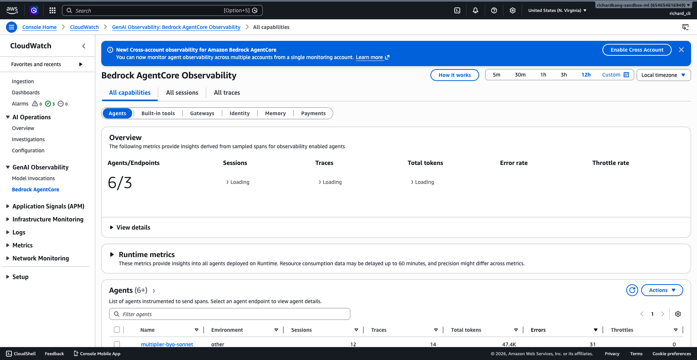

### 7.1 OTEL Configuration: Managed Agents (AgentCore Runtime)

For managed agents, the AgentCore Runtime provides an **OTEL sidecar** that handles all instrumentation automatically. No OTEL configuration is needed in your agent code.

**What the sidecar does:**
1. Intercepts all Strands SDK spans (scope: `strands.telemetry.tracer`)
2. Exports spans to `aws/spans` CloudWatch log group
3. Exports log events to the runtime-specific log group
4. **Creates the `invoke_agent` log event** (aggregates user query + final response)
5. Sets resource attributes automatically (`service.name`, `aws.log.group.names`, etc.)

**Agent code (minimal — no OTEL setup needed):**

```python
# agents/main.py (managed agent entrypoint)
import os, sys
os.environ["BYPASS_TOOL_CONSENT"] = "true"
sys.path.insert(0, os.path.dirname(os.path.abspath(__file__)))

# Initialize Strands OTEL tracer — the sidecar hooks into this
from strands.telemetry.tracer import get_tracer
get_tracer()

from bedrock_agentcore.runtime import BedrockAgentCoreApp
from agent import create_agent

app = BedrockAgentCoreApp()

@app.handler
def handler(session_id, prompt, **kwargs):
    agent = create_agent(os.environ.get("AGENT_MODEL_KEY", "sonnet"))
    return agent(prompt)

app.run()
```

**OTEL data flow (managed):**

```
┌─────────────────────────────────────────────────────────────────────┐
│  AgentCore Runtime Container                                         │
│                                                                      │
│  ┌──────────────────────┐    ┌──────────────────────────────────┐   │
│  │  Your Agent Code      │    │  OTEL Sidecar (automatic)         │   │
│  │  (Strands SDK)        │───▶│  • Collects spans                 │   │
│  │  get_tracer()         │    │  • Creates invoke_agent event     │   │
│  └──────────────────────┘    │  • Exports via OTLP               │   │
│                               └──────────────┬───────────────────┘   │
└──────────────────────────────────────────────┼───────────────────────┘
                                               │
                              ┌─────────────────▼─────────────────────┐
                              │  CloudWatch                            │
                              │                                        │
                              │  aws/spans (spans)                     │
                              │  /aws/bedrock-agentcore/runtimes/      │
                              │    eddpoc_multiplier_hr_sonnet-        │
                              │    5YhsT625tI-DEFAULT (events)         │
                              └────────────────────────────────────────┘
```

**Sample span from managed agent (in `aws/spans`):**

```json
{
  "traceId": "6a012f806b92e0b069c910684a2f01d4",
  "spanId": "e79d2156ac138f63",
  "parentSpanId": "ec3c4c7fb2603f7a",
  "name": "invoke_agent Strands Agents",
  "scope": {"name": "strands.telemetry.tracer", "version": ""},
  "kind": "INTERNAL",
  "startTimeUnixNano": 1778309938000000000,
  "endTimeUnixNano": 1778309952000000000,
  "attributes": {
    "gen_ai.operation.name": "invoke_agent",
    "gen_ai.agent.name": "Strands Agents",
    "gen_ai.request.model": "us.anthropic.claude-sonnet-4-6",
    "gen_ai.usage.input_tokens": 4608,
    "gen_ai.usage.output_tokens": 822,
    "gen_ai.usage.total_tokens": 5430,
    "gen_ai.agent.tools": "[\"employee_lookup\", \"compliance_checker\", \"payroll_calculator\", \"leave_manager\"]",
    "session.id": "55bb3c9b-b324-465e-9fe5-f37a2724138c",
    "aws.local.service": "eddpoc_multiplier_hr_sonnet.DEFAULT",
    "PlatformType": "AWS::BedrockAgentCore"
  },
  "resource": {
    "attributes": {
      "service.name": "eddpoc_multiplier_hr_sonnet.DEFAULT",
      "aws.log.group.names": "/aws/bedrock-agentcore/runtimes/eddpoc_multiplier_hr_sonnet-5YhsT625tI-DEFAULT",
      "cloud.platform": "aws_bedrock_agentcore",
      "aws.service.type": "gen_ai_agent"
    }
  },
  "status": {"code": "OK"}
}
```

### 7.2 OTEL Configuration: BYO Agents (Outside AgentCore Runtime)

For BYO agents, you configure OTEL via environment variables and wrap the agent with `opentelemetry-instrument`. The **AWS Distro for OpenTelemetry (ADOT)** handles the export pipeline.

**Required environment variables:**

```bash
# Core ADOT configuration
AGENT_OBSERVABILITY_ENABLED=true
OTEL_PYTHON_DISTRO=aws_distro
OTEL_PYTHON_CONFIGURATOR=aws_configurator
OTEL_EXPORTER_OTLP_PROTOCOL=http/protobuf
OTEL_TRACES_EXPORTER=otlp

# Service identification + log group routing
OTEL_RESOURCE_ATTRIBUTES="service.name=multiplier-byo-sonnet,aws.log.group.names=/aws/bedrock-agentcore/runtimes/multiplier-byo-sonnet,aws.service.type=gen_ai_agent"

# Log events export destination (critical for evaluation)
OTEL_EXPORTER_OTLP_LOGS_HEADERS="x-aws-log-group=/aws/bedrock-agentcore/runtimes/multiplier-byo-sonnet,x-aws-log-stream=runtime-logs,x-aws-metric-namespace=bedrock-agentcore"

# Session tracking
BYO_SESSION_ID="byo-sonnet-unique-session-id"
```

**Agent code (BYO runner):**

```python
# agents/byo_runner.py
from strands.telemetry.tracer import get_tracer
get_tracer()  # Initialize Strands OTEL tracer

from opentelemetry import baggage
from opentelemetry.context import attach
ctx = baggage.set_baggage("session.id", session_id)
attach(ctx)

from agent import create_agent
agent = create_agent(model_key)
result = agent(prompt)
```

**Invocation command:**

```bash
opentelemetry-instrument python agents/byo_runner.py --model sonnet --prompt "..."
```

**OTEL data flow (BYO):**

```
┌─────────────────────────────────────────────────────────────────────┐
│  Your Compute (EC2, ECS, Lambda, local machine)                      │
│                                                                      │
│  ┌──────────────────────┐    ┌──────────────────────────────────┐   │
│  │  Your Agent Code      │    │  ADOT (opentelemetry-instrument)  │   │
│  │  (Strands SDK)        │───▶│  • Collects spans                 │   │
│  │  get_tracer()         │    │  • Collects log events            │   │
│  └──────────────────────┘    │  • Exports via OTLP/HTTP          │   │
│                               └──────────────┬───────────────────┘   │
└──────────────────────────────────────────────┼───────────────────────┘
                                               │
                              ┌─────────────────▼─────────────────────┐
                              │  CloudWatch                            │
                              │                                        │
                              │  aws/spans (spans)                     │
                              │  /aws/bedrock-agentcore/runtimes/      │
                              │    multiplier-byo-sonnet (events)       │
                              └────────────────────────────────────────┘
```

**Sample span from BYO agent (in `aws/spans`):**

```json
{
  "traceId": "6a014bf55b2682b8e8f8144c706a9b3d",
  "spanId": "9625d3bc8a58eb96",
  "parentSpanId": "",
  "name": "invoke_agent Strands Agents",
  "scope": {"name": "strands.telemetry.tracer", "version": ""},
  "kind": "INTERNAL",
  "startTimeUnixNano": 1778310564000000000,
  "endTimeUnixNano": 1778310572000000000,
  "attributes": {
    "gen_ai.operation.name": "invoke_agent",
    "gen_ai.agent.name": "Strands Agents",
    "gen_ai.request.model": "us.anthropic.claude-sonnet-4-6",
    "gen_ai.usage.input_tokens": 2741,
    "gen_ai.usage.output_tokens": 320,
    "gen_ai.usage.total_tokens": 3061,
    "gen_ai.agent.tools": "[\"employee_lookup\", \"compliance_checker\", \"payroll_calculator\", \"leave_manager\"]",
    "session.id": "byo-sonnet-unique-session-id",
    "aws.local.service": "multiplier-byo-sonnet",
    "PlatformType": "Generic"
  },
  "resource": {
    "attributes": {
      "service.name": "multiplier-byo-sonnet",
      "aws.log.group.names": "/aws/bedrock-agentcore/runtimes/multiplier-byo-sonnet",
      "aws.service.type": "gen_ai_agent",
      "telemetry.sdk.name": "opentelemetry",
      "telemetry.auto.version": "0.17.0-aws"
    }
  },
  "status": {"code": "OK"}
}
```

### 7.3 Key Differences Between Managed and BYO OTEL

| Aspect | Managed (AgentCore Runtime) | BYO (ADOT) |
|--------|---------------------------|-------------|
| **OTEL setup** | Automatic (sidecar) | Manual (env vars + `opentelemetry-instrument`) |
| **Spans destination** | `aws/spans` | `aws/spans` |
| **Events destination** | `/aws/bedrock-agentcore/runtimes/{runtimeId}-DEFAULT` | `/aws/bedrock-agentcore/runtimes/{service-name}` |
| **`invoke_agent` log event** | ✅ Created by sidecar | ❌ Not created (Strands SDK gap) |
| **`chat` span events** | ✅ Present | ✅ Present |
| **`execute_tool` span events** | ✅ Present | ✅ Present |
| **`service.name`** | `eddpoc_{runtime_name}.DEFAULT` | Custom (e.g., `multiplier-byo-sonnet`) |
| **`PlatformType`** | `AWS::BedrockAgentCore` | `Generic` |
| **`cloud.platform`** | `aws_bedrock_agentcore` | Not set |
| **Session ID source** | Auto-generated by Runtime | Set via `BYO_SESSION_ID` env var + OTEL baggage |

### 7.4 Observability Sequence Diagram

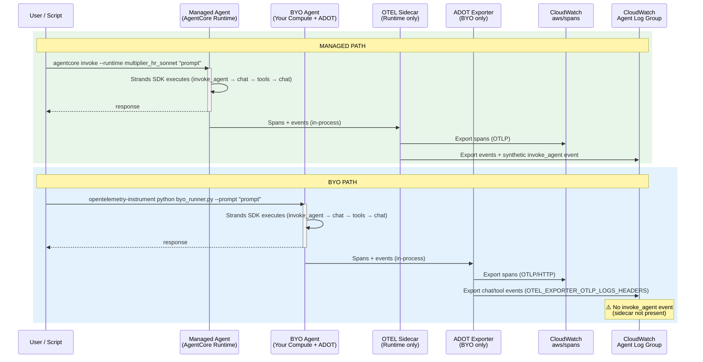

### 7.5 OpenTelemetry Trace Structure

Every agent invocation produces a trace — a tree of spans representing every action:

```
invoke_agent Strands Agents (root span, 14.82s)
├── execute_event_loop_cycle (4.67s)
│   ├── chat (4.66s)
│   │   ├── Bedrock Runtime.CountTokens (0.80s)
│   │   └── chat us.anthropic.claude-sonnet-4-6 (3.86s) [1,202 → 164 tokens]
│   ├── execute_tool employee_lookup (0s)
│   └── execute_tool compliance_checker (0s)
├── execute_event_loop_cycle (cycle 2)
│   ├── chat → chat us.anthropic.claude-sonnet-4-6
│   └── execute_tool payroll_calculator
└── execute_event_loop_cycle (cycle 3, final synthesis)
    └── chat → chat us.anthropic.claude-sonnet-4-6
```

This structure is **identical** for both managed and BYO agents — same span names, same scope, same attributes. The only differences are in `resource.attributes` (service name, platform type).

### 7.6 CloudWatch GenAI Observability Dashboard

The dashboard provides a unified view of all agents (both managed and BYO):

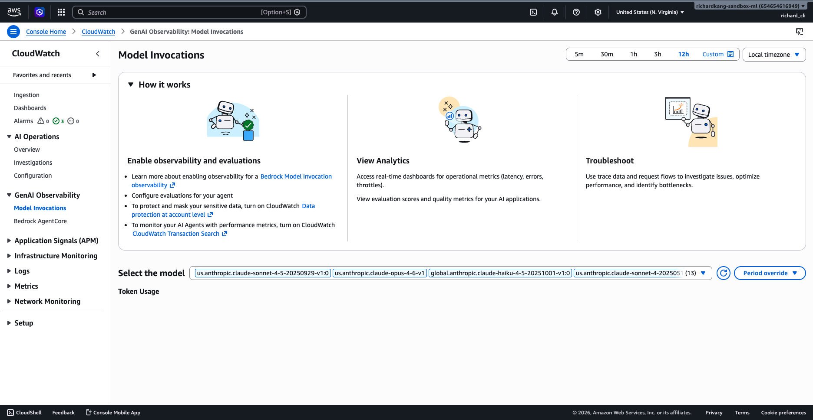

**Key metrics visible:**
- Sessions, traces, and spans for each agent
- Token usage (input/output) over time
- Latency distribution
- Error rates
- Tool execution counts

---

## 8. Evaluation System

### Built-in Evaluators

The `strands-agents-evals` SDK provides 8 evaluators:

| Evaluator | What It Measures | Score Range |
|-----------|-----------------|-------------|
| Helpfulness | Was the response useful? | 0.0 – 1.0 |
| Faithfulness | Is it grounded in tool outputs? | 0.0 – 1.0 |
| Coherence | Is it well-structured? | 0.0 – 1.0 |
| Correctness | Does it match ground truth? | 0.0 – 1.0 |
| Harmfulness | Does it avoid harmful content? | 0.0 – 1.0 |
| Answer Relevancy | Does it address the question? | 0.0 – 1.0 |
| Tool Selection Accuracy | Did it pick the right tools? | 0.0 – 1.0 |
| Tool Parameter Accuracy | Did it pass correct params? | 0.0 – 1.0 |

### Custom Evaluator: LLM-as-a-Judge (`multiplier_domain_accuracy`)

An LLM (Claude Sonnet 4.5) reads the agent's trace and scores it on a rubric:

```
Criteria:
1. Factual Accuracy — Are the facts correct?
2. Completeness — Does it fully address the question?
3. Compliance Safety — Does it avoid dangerous advice?

Scale:
1.0 = Excellent (accurate, complete, compliant)
0.75 = Good (mostly accurate, minor gaps)
0.5 = Adequate (partially correct, missing details)
0.25 = Poor (significant errors)
0.0 = Unacceptable (wrong or unsafe)
```

### Custom Evaluator: Lambda (`multiplier_deterministic`)

A Lambda function runs 4 binary checks against each trace:

| Check | What It Verifies | Pass Condition |
|-------|-----------------|----------------|
| `tool_usage` | Agent called at least one tool | Any tool span exists |
| `no_empty_params` | Tool calls have non-empty parameters | All tool spans have params |
| `has_response` | Agent produced a non-empty response | Response length > 0 |
| `under_latency` | Total execution under threshold | Duration < 30 seconds |

Score = passing checks / 4 (e.g., 3/4 = 0.75)

### Online Evaluation Configuration

For managed agents, online evaluation auto-scores every invocation:

```json
{
  "name": "eval_sonnet",
  "agent": "multiplier_hr_sonnet",
  "evaluators": ["multiplier_domain_accuracy"],
  "samplingRate": 100,
  "enableOnCreate": true
}
```

### Ground-Truth Comparison Methodology

The most rigorous evaluation approach:

1. **Baseline:** Run Sonnet (highest quality model) and capture its responses
2. **Contenders:** Run Haiku and Nova Pro with the same prompts
3. **Score:** Use `CorrectnessEvaluator` to compare contender responses against Sonnet's (binary CORRECT/INCORRECT)
4. **Rank:** Combine correctness + helpfulness + cost for final recommendation

### 8.1 Unified Trajectory Evaluation (Implemented)

> **Status: ✅ Complete.** This section describes the **implemented** unified evaluation architecture. It supersedes the dual-evaluation approach described in Section 10 and the earlier `run_unified_comparison.py` attempt that used the LLM-as-a-Judge evaluator (which failed for BYO agents due to the `invoke_agent` log event gap).

#### Why a Code-Based (Lambda) Evaluator?

The LLM-as-a-Judge evaluator (`multiplier_domain_accuracy`) requires an `invoke_agent` log event with `body.input`/`body.output`. For managed agents this event is emitted by the AgentCore Runtime sidecar; for BYO agents the Strands SDK does not emit it. Attempting to use LLM-as-a-Judge for BYO agents fails with `LogEventMissingException`.

Code-based evaluators use a different service code path that does not require that log event. Instead, the service normalizes spans, **strips event bodies**, and invokes the Lambda with metadata only. This works identically for managed and BYO because both emit the same span metadata shape.

#### Architecture: Single Evaluator + Single Comparator

```
┌─────────────────────────────────────────────────────────────────────────┐
│              scripts/run_trajectory_comparison.py                         │
│                      (Single Comparator)                                 │
├─────────────────────────────────────────────────────────────────────────┤
│                                                                          │
│  Phase 1 — Invocation (ThreadPoolExecutor max_workers=6)                 │
│  ┌──────────────────────────┐   ┌──────────────────────────┐             │
│  │  Managed (3 agents)       │   │  BYO (3 agents)           │             │
│  │  agentcore invoke          │   │  opentelemetry-instrument │             │
│  │  → spans in aws/spans      │   │  → spans in aws/spans     │             │
│  └──────────────┬───────────┘   └──────────────┬───────────┘             │
│                 │                              │                         │
│  Phase 2 — Trace Propagation Wait (120 s default)                        │
│                 │                              │                         │
│  Phase 3 — Trace Discovery + Evaluation                                  │
│  ┌──────────────▼──────────────────────────────▼───────────┐             │
│  │  discover_trace_ids() — CW Logs Insights on aws/spans    │             │
│  │  fetch_session_spans() — spans + events for trace        │             │
│  │                                                          │             │
│  │  agentcore.evaluate(                                     │             │
│  │    evaluatorId="multiplier_trajectory_eval-Evy2MEDqBq",  │             │
│  │    evaluationInput={sessionSpans: [...]},                │             │
│  │    evaluationTarget={traceIds: [...]})                   │             │
│  │                                                          │             │
│  │  ┌────────────────────────────────────────────────┐      │             │
│  │  │ AgentCore service normalizes spans, strips     │      │             │
│  │  │ event bodies, invokes the Lambda:              │      │             │
│  │  │                                                │      │             │
│  │  │  eddpoc-trajectory-evaluator                   │      │             │
│  │  │    analyze_trajectory() → score_trajectory()   │      │             │
│  │  │    → {label, value, explanation}               │      │             │
│  │  └────────────────────────────────────────────────┘      │             │
│  └──────────────────────────┬───────────────────────────────┘             │
│                             │                                            │
│  Phase 4 — Report Generation                                             │
│  ┌──────────────────────────▼───────────────────────────────┐             │
│  │  generate_report() → results/trajectory_comparison.md    │             │
│  │  Also saves: trajectory_invocations.json,                │             │
│  │              trajectory_evaluations.json                  │             │
│  └──────────────────────────────────────────────────────────┘             │
└─────────────────────────────────────────────────────────────────────────┘
```

#### Key Finding: AgentCore Normalizes Spans Before Invoking Code-Based Evaluators

When you pass `sessionSpans` to the evaluate API with a code-based evaluator, the service **normalizes and filters** them before invoking the Lambda:

- **Log events (with `body`) are stripped entirely** — Lambda receives 0 events even when dozens are passed in
- **Span inline `events` and `span_events` fields are empty**
- **Only span metadata survives** — attributes, status, scope, timing, session.id
- **Both camelCase and snake_case keys** are provided (e.g., `parentSpanId` + `parent_span_id`)

This means code-based evaluators **cannot score on content** (user query, assistant response, tool parameters, tool results). They score on **trajectory structure and metadata** only. The design turns this constraint into a feature — the rubric is deterministic and deployment-agnostic.

#### Scoring Rubric (6 Criteria, 100 Points)

| Criterion | Weight | Rule |
|---|---|---|
| Agent presence | 20 | 20 if ≥1 `strands.telemetry.tracer` invoke_agent span exists, else 0 |
| Tool success | 30 | `30 × (successful_tool_calls / total_tool_calls)`, or 15 if no tool calls |
| Tool variety | 10 | 10 if distinct tool names ≥ 2, 7 if exactly 1, 0 if none |
| Error-free | 15 | `15 − min(15, error_span_count × 5)` (strands-scoped only) |
| Latency | 15 | Linear decay 15→5 as `agent_duration_s` approaches 30s; 0 above threshold |
| Efficiency | 10 | 10 if tool calls ≤ 10 and LLM calls ≤ 8 and ≥1 of either exists, else 0 |
| **Total** | **100** | Normalized to 0.0–1.0 for return value |

Label mapping: `≥0.90 Excellent`, `≥0.75 Very Good`, `≥0.60 Good`, `≥0.40 Poor`, `<0.40 Unacceptable`.

#### The evaluate() Call — Identical for Both Deployment Types

```python
# Same call for managed AND BYO — no branching on agent_type
agentcore.evaluate(
    evaluatorId="multiplier_trajectory_eval-Evy2MEDqBq",
    evaluationInput={"sessionSpans": [<spans from CloudWatch>]},
    evaluationTarget={"traceIds": [trace_id]},
)
```

There is no branching on deployment type. Managed and BYO are indistinguishable at the API level.

#### Deployed Resources

| Resource | Identifier |
|---|---|
| IAM role | `eddpoc-trajectory-evaluator-role` |
| Lambda function | `eddpoc-trajectory-evaluator` |
| Lambda ARN | `arn:aws:lambda:us-east-1:654654616949:function:eddpoc-trajectory-evaluator` |
| Evaluator name | `multiplier_trajectory_eval` |
| Evaluator ID | `multiplier_trajectory_eval-Evy2MEDqBq` |

All resources tagged `app=multiplier-hr-agent, project=eddpoc, env=dev`.

#### Latest Results (30/30 Successful)

| Deployment | Avg Score | Per-Model Scores |
|---|---|---|
| **Managed** | **0.952** | sonnet=0.952, nova_2_pro=0.952, glm_5=0.952 |
| **BYO** | **0.949** | sonnet=0.946, nova_2_pro=0.964, glm_5=0.938 |

All 30 evaluations scored "Excellent" (≥0.90). Per-model deltas are within noise (max Δ=0.034 for glm_5), confirming the unified path produces directly comparable results.

#### How to Run

```bash
# Deploy the evaluator (idempotent)
python evaluators/deploy_trajectory_evaluator.py

# Run the full comparison (~7 min)
AWS_PROFILE=ml-sandbox python scripts/run_trajectory_comparison.py

# Custom wait time
WAIT_SECONDS=180 python scripts/run_trajectory_comparison.py
```

#### What Remains Open

Content-level evaluation (factual accuracy, completeness, compliance safety) for BYO agents is still blocked by the `invoke_agent` log event gap. The trajectory evaluator handles structure; a future external content judge (calling Bedrock directly, bypassing AgentCore) could handle content. See [`BYO_AgentCore_Observability_issue.md`](./BYO_AgentCore_Observability_issue.md) for the full issue documentation.

#### Evolution from Old Approach

| Aspect | Old (Dual-Evaluation) | Intermediate (`run_unified_comparison.py`) | Current (`run_trajectory_comparison.py`) |
|--------|----------------------|-------------------------------------------|------------------------------------------|
| Managed evaluation | `agentcore run eval` CLI | `evaluate(runtimeArn, sessionId)` | `evaluate(sessionSpans)` |
| BYO evaluation | In-memory `strands-agents-evals` SDK | `evaluate(sessionSpans)` | `evaluate(sessionSpans)` |
| Evaluator | Different per path | Same (`multiplier_domain_accuracy`) | Same (`multiplier_trajectory_eval`) |
| BYO works? | ✅ (different scores) | ❌ (`LogEventMissingException`) | ✅ (identical path) |
| Scores comparable? | ❌ | ❌ (BYO fails) | ✅ |
| Evaluator type | Mixed | LLM-as-a-Judge | Code-based (Lambda) |
| Scores on | Content + structure | Content | Structure (metadata only) |

---

## 9. Agentic Trajectory Comparison

The traces captured during evaluation contain the **full agentic loop** — every reasoning step, tool decision, parameter selection, and synthesis. This section compares how each model navigates the same task.

### What's Captured in Each Trace

Each trace file (`results/traces/{model}_prompt_{n}.json`) contains OTEL spans of three types:

| Span Type | What It Captures | Example |
|-----------|-----------------|---------|
| `inference` | Model reasoning + tool decisions | `<thinking>I need salary first</thinking>` → `tool_use: employee_lookup(...)` |
| `execute_tool` | Tool call params + raw result | `employee_lookup(EMP-11111, India)` → `{"salary": 55000}` |
| `inference` (cycle 2+) | Post-tool reasoning + next action | Sees salary=55000 → calls `payroll_calculator(55000, INR)` |

### Trajectory Comparison: Multi-Tool Query (Prompt 5)

**Prompt:** "For employee EMP-11111 in India, look up their details, check compliance rules, and calculate their payroll breakdown in INR."

This is the most revealing prompt — it requires 3 tools and the model must decide whether to call them sequentially (waiting for salary) or in parallel (guessing salary).

#### Sonnet 4.6 — Sequential with Parallel Optimization (12.5s)

```
┌─────────────────────────────────────────────────────────────────┐
│ Cycle 1: Reasoning + Parallel Tool Calls                         │
├─────────────────────────────────────────────────────────────────┤
│ 🧠 "I can fetch employee details and compliance rules            │
│    simultaneously, then use the salary for payroll."             │
│                                                                  │
│ 🔧 employee_lookup(EMP-11111, India)  ──┐                        │
│ 🔧 compliance_checker(India)          ──┤ PARALLEL               │
│                                         │                        │
│ 📥 {"salary": 55000, "dept": "Product"} ◄┘                       │
│ 📥 {"notice_periods": {...}, ...}       ◄┘                       │
├─────────────────────────────────────────────────────────────────┤
│ Cycle 2: Use Actual Salary                                       │
├─────────────────────────────────────────────────────────────────┤
│ 🧠 "Got salary = 55,000 INR. Now calculate payroll."             │
│ 🔧 payroll_calculator(55000, India, INR)                         │
│ 📥 {"gross_monthly": 4583.33, "net": 3116.67}                   │
├─────────────────────────────────────────────────────────────────┤
│ Cycle 3: Final Synthesis                                         │
├─────────────────────────────────────────────────────────────────┤
│ 💬 Formatted table with employee details + compliance +          │
│    payroll breakdown. Rich markdown with emojis.                 │
└─────────────────────────────────────────────────────────────────┘
```

**Strategy:** Parallel where safe (lookup + compliance don't depend on each other), sequential where needed (payroll needs salary from lookup). **3 inference cycles, 3 tool calls.**

#### Nova 2 Pro — Fully Sequential with Explicit Reasoning (6.6s)

```
┌─────────────────────────────────────────────────────────────────┐
│ Cycle 1: Reasoning + First Tool                                  │
├─────────────────────────────────────────────────────────────────┤
│ 🧠 <thinking> I need to:                                         │
│    1. Look up employee details (to get salary)                   │
│    2. Check compliance rules                                     │
│    3. Calculate payroll (needs salary from step 1)               │
│    I'll start with employee_lookup. </thinking>                  │
│                                                                  │
│ 🔧 employee_lookup(EMP-11111, India)                             │
│ 📥 {"salary": 55000, "dept": "Product"}                          │
├─────────────────────────────────────────────────────────────────┤
│ Cycle 2: Parallel (compliance + payroll)                         │
├─────────────────────────────────────────────────────────────────┤
│ 🧠 <thinking> Now I have salary=55000.                           │
│    I can call compliance + payroll in parallel. </thinking>      │
│                                                                  │
│ 🔧 compliance_checker(India)          ──┐ PARALLEL               │
│ 🔧 payroll_calculator(55000, India, INR)┘                        │
│ 📥 {"notice_periods": {...}}            ◄┘                       │
│ 📥 {"net_monthly": 3116.67}            ◄┘                       │
├─────────────────────────────────────────────────────────────────┤
│ Cycle 3: Final Synthesis                                         │
├─────────────────────────────────────────────────────────────────┤
│ 💬 Concise bullet-point summary. No markdown tables.             │
└─────────────────────────────────────────────────────────────────┘
```

**Strategy:** Sequential first (get salary), then parallel (compliance + payroll). Explicit `<thinking>` tags show reasoning. **3 inference cycles, 3 tool calls.** Fastest overall.

#### GLM 5 — Parallel All-at-Once (20.3s)

```
┌─────────────────────────────────────────────────────────────────┐
│ Cycle 1: All Tools in Parallel                                   │
├─────────────────────────────────────────────────────────────────┤
│ 🔧 employee_lookup(EMP-11111, India)    ──┐                      │
│ 🔧 compliance_checker(India)            ──┤ ALL PARALLEL         │
│ 🔧 payroll_calculator(55000, India, INR)──┘                      │
│                                                                  │
│ 📥 {"salary": 55000, ...}               ◄┘                      │
│ 📥 {"notice_periods": {...}}            ◄┘                       │
│ 📥 {"net_monthly": 3116.67}            ◄┘                       │
├─────────────────────────────────────────────────────────────────┤
│ Cycle 2: Final Synthesis                                         │
├─────────────────────────────────────────────────────────────────┤
│ 💬 Structured tables with ₹ currency symbols.                    │
│    Complete but slower due to large context window.              │
└─────────────────────────────────────────────────────────────────┘
```

**Strategy:** Calls all 3 tools simultaneously. In this run it correctly used 55000 (may have inferred from context), but this pattern is risky — if the salary isn't inferrable, it would guess. **2 inference cycles, 3 tool calls.** Slowest due to large model size.

### Tool Use Comparison Table

| Dimension | Sonnet 4.6 | Nova 2 Pro | GLM 5 |
|-----------|-----------|-----------|-------|
| **Avg Latency** | 8,613ms | 3,724ms | 13,041ms |
| **Inference Cycles (Prompt 5)** | 3 | 3 | 2 |
| **Tool Calls (Prompt 5)** | 3 | 3 | 3 |
| **Parallel Strategy** | Smart (parallel where safe) | Smart (sequential → parallel) | Aggressive (all parallel) |
| **Salary Handling** | ✅ Waits for lookup | ✅ Waits for lookup | ⚠️ Parallel (risky) |
| **Reasoning Visibility** | Hidden (natural language) | Explicit (`<thinking>` tags) | Hidden (no preamble) |
| **Response Format** | Rich markdown + emojis | Concise bullets | Structured tables |
| **Tool Parameter Order** | `(employee_id, country)` | `(country, employee_id)` | `(employee_id, country)` |

### Key Insight: Why Trajectory Comparison Matters

The tool use graph shows **what** was called. The trajectory comparison shows **why** and **how**:

- **Sonnet** reasons in natural language, parallelizes independent calls, and produces rich formatted output
- **Nova 2 Pro** shows explicit chain-of-thought, correctly identifies data dependencies, and is 2x faster
- **GLM 5** skips reasoning preamble, calls everything at once (risky for dependent tools), but produces correct results when parameters are inferrable

This is the kind of behavioral difference that simple correctness scores miss — two agents can both score 1.0 on correctness while having fundamentally different reliability profiles for edge cases.

### Graphical Trace Representations

We use three complementary visualizations to compare traces across models:

#### A. Timeline Waterfall — Where Does Time Go?

Shows each span as a horizontal bar, aligned to a common time axis. Immediately reveals parallelism and bottlenecks.

```mermaid
gantt
    title Prompt 5: Multi-Tool Query — Timeline Comparison
    dateFormat X
    axisFormat %s

    section Sonnet (12.5s)
    Inference 1 (reasoning)        :s1, 0, 3000
    employee_lookup                :s2, 3000, 3001
    compliance_checker             :s3, 3000, 3001
    Inference 2 (use salary)       :s4, 3001, 6500
    payroll_calculator             :s5, 6500, 6501
    Inference 3 (synthesize)       :s6, 6501, 12500

    section Nova 2 Pro (6.6s)
    Inference 1 (thinking)         :n1, 0, 2000
    employee_lookup                :n2, 2000, 2001
    Inference 2 (thinking)         :n3, 2001, 3700
    compliance_checker             :n4, 3700, 3701
    payroll_calculator             :n5, 3700, 3701
    Inference 3 (synthesize)       :n6, 3701, 6600

    section GLM 5 (20.3s)
    Inference 1 (plan)             :g1, 0, 5000
    employee_lookup                :g2, 5000, 5001
    compliance_checker             :g3, 5000, 5001
    payroll_calculator             :g4, 5000, 5001
    Inference 2 (synthesize)       :g5, 5001, 20300
```

**What this reveals:**
- Tool execution is near-instant (< 1ms) — all time is spent in **inference** (model thinking)
- Sonnet spends time on rich formatting in the final synthesis
- Nova 2 Pro's `<thinking>` is fast and focused — minimal synthesis time
- GLM 5's single long synthesis span suggests it's generating a very detailed response

#### B. Data Dependency DAG — What Depends on What?

Shows which tool calls depend on results from other calls. Reveals whether a model correctly identifies dependencies or makes unsafe parallel calls.

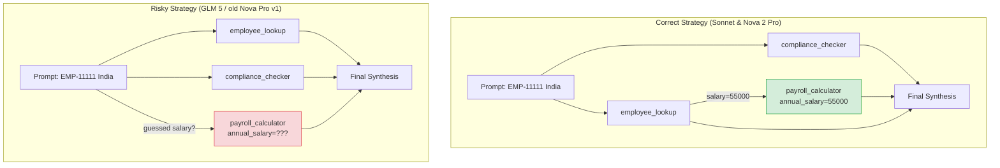

**What this reveals:**
- `payroll_calculator` has a **data dependency** on `employee_lookup` (needs salary)
- `compliance_checker` is **independent** — safe to call in parallel with lookup
- Models that call all 3 in parallel risk using a guessed/hallucinated salary
- The DAG makes the dependency explicit — useful for designing guardrails

#### C. Swim Lane Comparison — Same Prompt, Different Behaviors

Shows the step-by-step execution of all 3 models side-by-side for direct comparison.

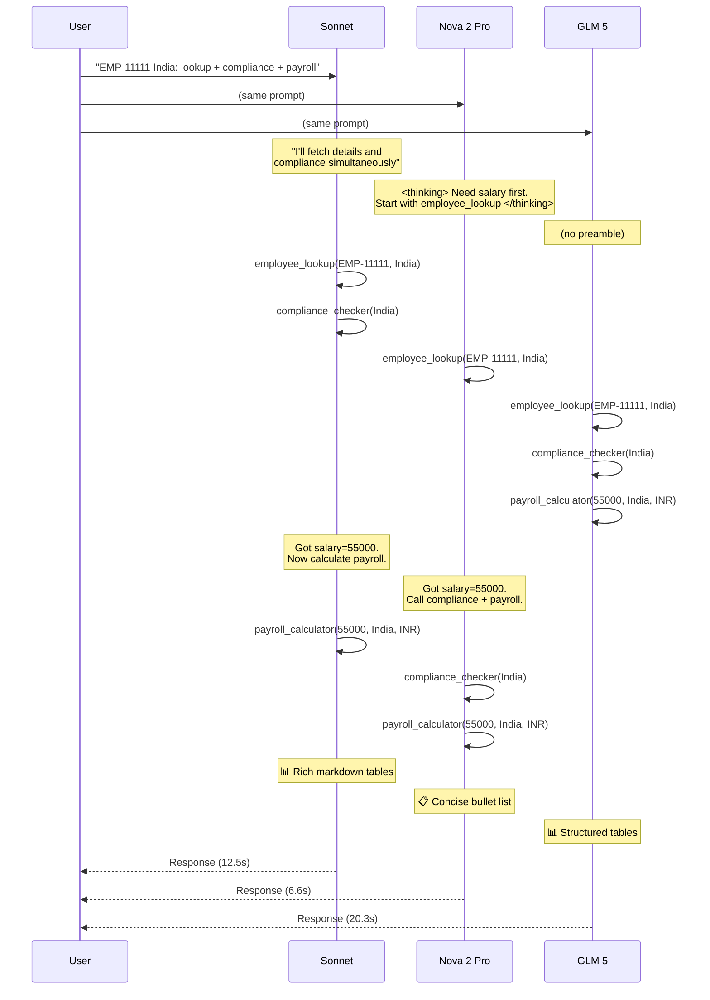

**What this reveals:**
- The **temporal ordering** of decisions across models
- Nova 2 Pro finishes first despite having more inference cycles (faster per-cycle)
- GLM 5 fires all tools immediately but takes longest overall (large model, slow generation)
- Sonnet's parallel strategy (lookup + compliance) is optimal for this dependency graph

#### D. Aggregate Trace Metrics — Comparing Across All Prompts

For comparing patterns across many invocations, a summary table with sparkline-style indicators:

| Metric | Sonnet | Nova 2 Pro | GLM 5 |
|--------|--------|-----------|-------|
| **Avg inference cycles/prompt** | 2.4 | 2.4 | 1.8 |
| **Avg tool calls/prompt** | 1.4 | 1.4 | 1.4 |
| **Parallel tool calls** | 1 (Prompt 5) | 1 (Prompt 5) | 1 (Prompt 5) |
| **Time in inference** | 95% | 95% | 95% |
| **Time in tools** | <1% | <1% | <1% |
| **Avg tokens/prompt** | ~1,800 | ~900 | ~1,400 |
| **Reasoning overhead** | 0% (hidden) | ~15% (thinking tags) | 0% (hidden) |

### How to Generate These Visualizations

The trace JSON files at `results/traces/{model}_prompt_{n}.json` contain all the data needed:

```python
# Extract timeline data from trace
for span in trace["spans"]:
    span_type = span["span_type"]  # "inference" or "execute_tool"
    start = span["span_info"]["start_time"]
    end = span["span_info"]["end_time"]
    
    if span_type == "execute_tool":
        tool_name = span["tool_call"]["name"]
        tool_args = span["tool_call"]["arguments"]
        tool_result = span["tool_result"]["content"]
    
    elif span_type == "inference":
        # Extract reasoning from assistant messages
        for msg in span["messages"]:
            if msg["role"] == "assistant":
                for content in msg["content"]:
                    if content["content_type"] == "tool_use":
                        # Tool decision point
                        ...
                    elif "<thinking>" in content.get("text", ""):
                        # Explicit reasoning
                        ...
```

The Mermaid diagrams above can be rendered in:
- GitHub/GitLab markdown (native support)
- VS Code with Mermaid extension
- Any Mermaid-compatible viewer (mermaid.live)
- Exported to PNG/SVG via `mmdc` CLI

---

## 10. Evaluation Sequence Diagrams

### 10.1 Unified Trajectory Evaluation (Current — Single Evaluator for Both Paths)

This is the **implemented** evaluation architecture. A single AgentCore code-based evaluator (Lambda) scores both managed and BYO agents through the same `evaluate()` API call.

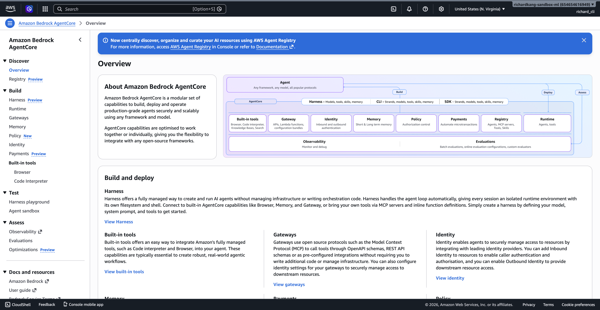

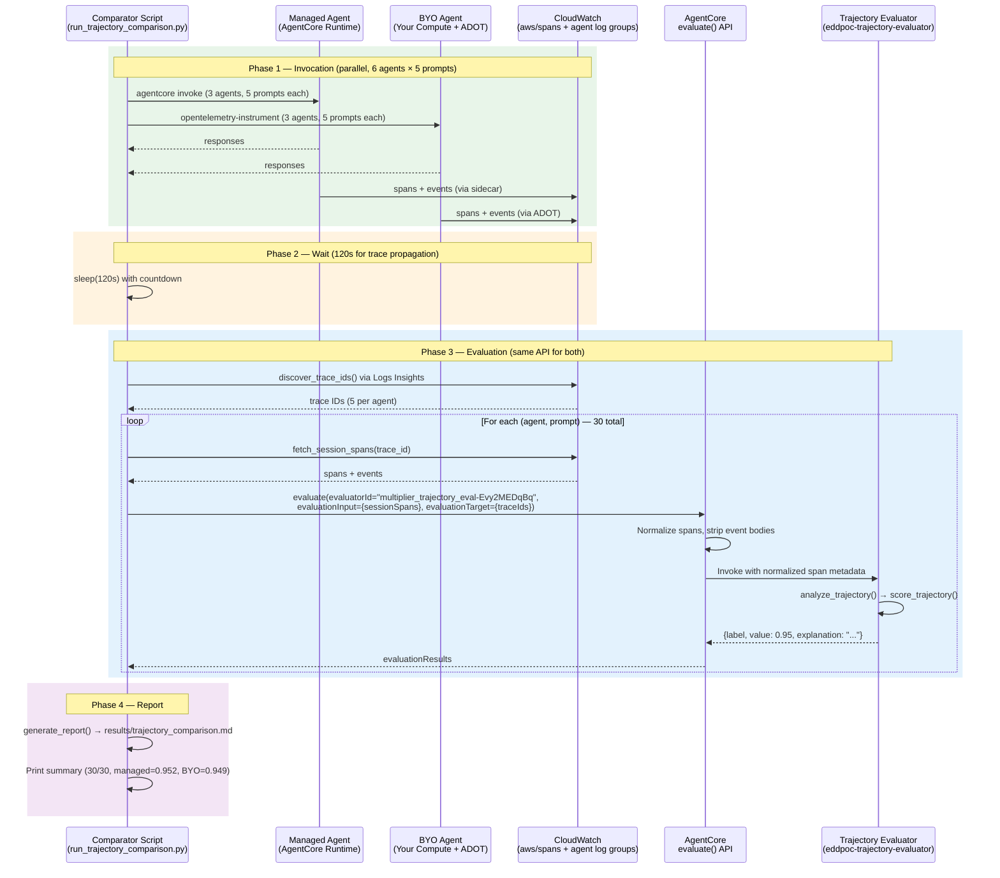

**Key points:**
- **Same evaluator ID** for both managed and BYO — no branching on agent type
- **Same API call shape** — `evaluate(evaluatorId, evaluationInput.sessionSpans, evaluationTarget.traceIds)`
- **AgentCore normalizes spans** before invoking Lambda — both deployment types look identical to the evaluator
- **Lambda scores on metadata** — tool selection, success rate, variety, errors, latency, efficiency
- **30/30 evaluations succeed** — managed avg 0.952, BYO avg 0.949

### 10.2 How the Code-Based Evaluator Works (Internal Flow)

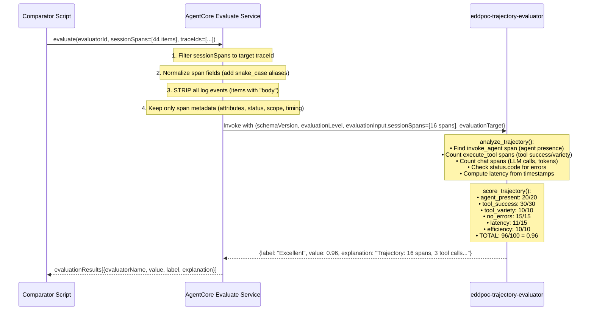

**What the Lambda receives (after service normalization):**

```json
{
  "schemaVersion": "1.0",
  "evaluatorId": "multiplier_trajectory_eval-Evy2MEDqBq",
  "evaluationLevel": "TRACE",
  "evaluationInput": {
    "sessionSpans": [
      {
        "name": "invoke_agent Strands Agents",
        "scope": {"name": "strands.telemetry.tracer"},
        "span_id": "9625d3bc8a58eb96",
        "trace_id": "6a014bf55b2682b8e8f8144c706a9b3d",
        "session_id": "byo-sonnet-p3-abc123",
        "source": "adot_cw",
        "attributes": {
          "gen_ai.operation.name": "invoke_agent",
          "gen_ai.usage.input_tokens": 2741,
          "gen_ai.usage.output_tokens": 320,
          "gen_ai.usage.total_tokens": 3061,
          "gen_ai.request.model": "us.anthropic.claude-sonnet-4-6",
          "gen_ai.agent.tools": "[\"employee_lookup\", ...]"
        },
        "status": {"code": "OK"},
        "startTimeUnixNano": 1778310564000000000,
        "endTimeUnixNano": 1778310572000000000,
        "duration_ms": 8000
      }
    ]
  },
  "evaluationTarget": {"traceIds": ["6a014bf55b2682b8e8f8144c706a9b3d"]}
}
```

**What the Lambda does NOT receive:**
- ❌ Log event bodies (user query text, assistant response text)
- ❌ Tool call parameters or results
- ❌ LLM prompt/completion content
- ❌ Any PII or conversation content

This is by design — the service enforces data governance by stripping content before invoking external code.

### 10.3 OTEL Differences That Affect Evaluation

| OTEL Element | Managed | BYO | Impact on Evaluation |
|---|---|---|---|
| `invoke_agent` **span** | ✅ Present in `aws/spans` | ✅ Present in `aws/spans` | ✅ Both score 20/20 on agent presence |
| `invoke_agent` **log event** | ✅ Created by sidecar | ❌ Not created | ⚠️ Blocks LLM-as-a-Judge for BYO (not needed for code-based) |
| `execute_tool` spans | ✅ With `gen_ai.tool.status` | ✅ With `gen_ai.tool.status` | ✅ Both score on tool success/variety |
| `chat` spans | ✅ With token counts | ✅ With token counts | ✅ Both score on efficiency |
| `session.id` attribute | ✅ Auto-set by Runtime | ✅ Set via OTEL baggage | ✅ Both discoverable by session |
| Span `status.code` | ✅ OK/ERROR | ✅ OK/ERROR | ✅ Both score on error-free execution |
| `gen_ai.request.model` | ✅ Present | ✅ Present | ✅ Both report model in explanation |

**Bottom line:** For the code-based trajectory evaluator, managed and BYO spans are **functionally identical**. The evaluator cannot distinguish between them.

### 10.4 Managed Path: Online Evaluation (LLM-as-a-Judge, Managed Only)

> This path works ONLY for managed agents because it requires the `invoke_agent` log event.

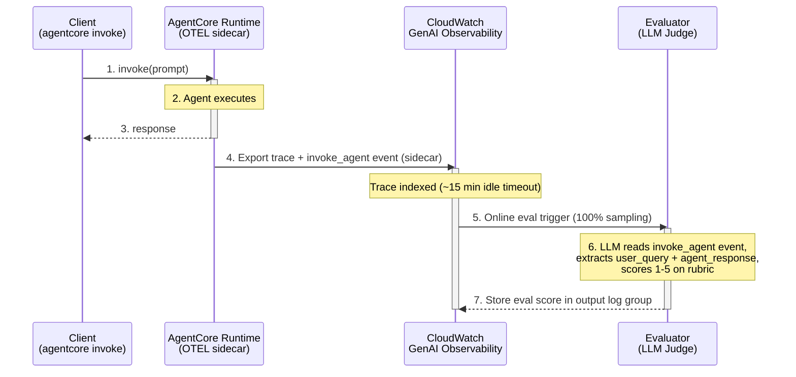

**Why this doesn't work for BYO:** Step 4 requires the sidecar to create the `invoke_agent` log event. Without it, Step 6 fails with `LogEventMissingException`. See [`BYO_AgentCore_Observability_issue.md`](./BYO_AgentCore_Observability_issue.md).

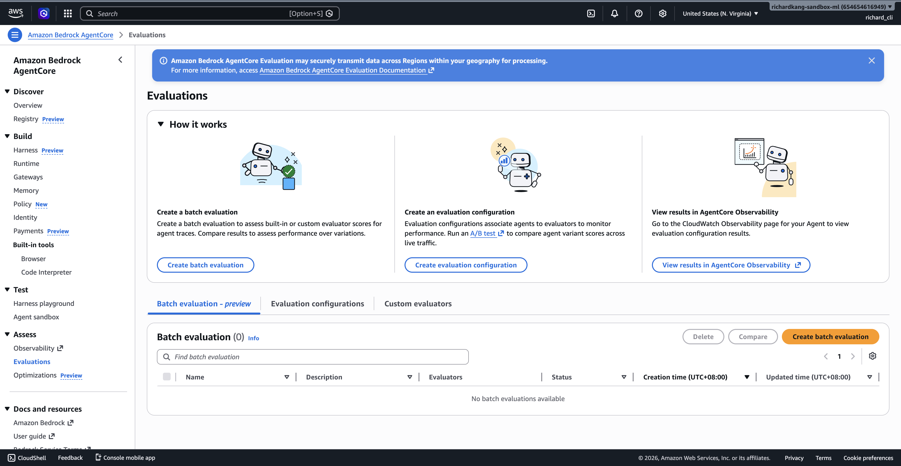

---

## 11. Results & Comparison

### 6-Agent Registry Comparison (Latest Run: May 8, 2026)

**30 invocations total** (5 prompts × 6 agents), all concurrent via ThreadPoolExecutor.

| Agent | Model | Type | Correctness | Helpfulness |
|-------|-------|------|-------------|-------------|
| multiplier_hr_sonnet | Claude Sonnet 4 | managed | 1.000 | 1.000 |
| multiplier_hr_haiku | Claude Haiku 4.5 | managed | 1.000 | 0.933 |
| multiplier_hr_nova_pro | Amazon Nova Pro | managed | 0.800 | 0.867 |
| multiplier_byo_sonnet | Claude Sonnet 4 | byo | 1.000 | 1.000 |
| multiplier_byo_haiku | Claude Haiku 4.5 | byo | 1.000 | 1.000 |
| multiplier_byo_nova_pro | Amazon Nova Pro | byo | 1.000 | 0.833 |

### Per-Prompt Correctness Matrix

| # | Prompt | Sonnet (M) | Haiku (M) | Nova Pro (M) | Sonnet (B) | Haiku (B) | Nova Pro (B) |
|---|--------|:---:|:---:|:---:|:---:|:---:|:---:|
| 1 | Employment status of EMP-12345 in Singapore | ✓ | ✓ | ✓ | ✓ | ✓ | ✓ |
| 2 | Notice periods for Thailand | ✓ | ✓ | ✓ | ✓ | ✓ | ✓ |
| 3 | Payroll breakdown for 90000 SGD | ✓ | ✓ | ✓ | ✓ | ✓ | ✓ |
| 4 | Leave balance for EMP-67890 | ✓ | ✓ | ✓ | ✓ | ✓ | ✓ |
| 5 | Multi-tool: EMP-11111 India (lookup + compliance + payroll) | ✓ | ✓ | **✗** | ✓ | ✓ | ✓ |

**Key finding:** Nova Pro (managed) fails on Prompt 5 because it calls all 3 tools in parallel — including `payroll_calculator` with a **guessed salary** (1,000,000 INR) instead of waiting for the `employee_lookup` result (actual: 55,000 INR). This is exactly the kind of issue EDD catches.

### Latency Comparison

| Agent | Type | Avg Latency |
|-------|------|-------------|
| multiplier_hr_sonnet | managed | 17,096 ms |
| multiplier_hr_haiku | managed | 16,774 ms |
| multiplier_hr_nova_pro | managed | 15,937 ms |
| multiplier_byo_sonnet | byo | 11,882 ms |
| multiplier_byo_haiku | byo | 7,517 ms |
| multiplier_byo_nova_pro | byo | 7,320 ms |

BYO agents are consistently faster because they avoid the AgentCore Runtime overhead (cold start, routing).

### Cost-Performance Analysis

| Model | WQS | Cost/Interaction | CAP Score | Latency | Suggested Use |
|-------|-----|-----------------|-----------|---------|---------------|
| Sonnet | 0.931 | $0.00840 | 1.11 | 8,040ms | Default production model |
| Haiku | 0.908 | $0.00280 | 3.24 | 4,885ms | Simple queries, low-risk tasks |
| Nova Pro | 0.859 | $0.00192 | 4.48 | 3,603ms | Cost-sensitive (with caveats) |

**WQS (Weighted Quality Score):**
```
WQS = 0.25(Task Success) + 0.20(Faithfulness) + 0.15(Helpfulness) +
      0.15(Coherence) + 0.15(Tool Reliability) + 0.10(Multi-turn Robustness)
```

**CAP (Cost-Adjusted Performance):** WQS / Cost — higher is better value.

### Recommendation

Based on the evaluation data:

1. **Sonnet** — Use as the production default for maximum accuracy. The $0.0056/interaction premium over Haiku is negligible at scale ($56/month at 10K interactions) compared to the risk of incorrect compliance advice.

2. **Haiku** — Viable for simple single-tool queries (employee lookup, leave balance). Not recommended for complex multi-tool queries where it occasionally misses context.

3. **Nova Pro** — Fastest and cheapest, but **do not use for multi-tool queries** without additional guardrails. Its tendency to call all tools in parallel with guessed parameters creates correctness failures.

---

## 12. How to Reproduce

### Prerequisites
- AWS account with Bedrock model access (Sonnet 4, Haiku 4.5, Nova Pro, Sonnet 4.5 for judge)
- `agentcore` CLI installed
- Python 3.11
- AWS credentials configured

### Quick Start

```bash
cd edd-poc
python3.11 -m venv .venv && source .venv/bin/activate
pip install -r requirements.txt

# Deploy the trajectory evaluator (one-time, idempotent)
python evaluators/deploy_trajectory_evaluator.py

# Run the unified trajectory comparison (recommended — ~7 min)
AWS_PROFILE=ml-sandbox python scripts/run_trajectory_comparison.py

# Custom wait time for trace propagation
WAIT_SECONDS=180 python scripts/run_trajectory_comparison.py
```

> **Note:** The old `scripts/run_unified_comparison.py` and `scripts/run_registry_comparison.py` are deprecated. Use `scripts/run_trajectory_comparison.py` which evaluates both managed and BYO agents through the same code-based Lambda evaluator via the AgentCore Evaluate API.

### Individual Paths

**Managed (invoke via AgentCore):**
```bash
agentcore invoke --runtime multiplier_hr_sonnet "What is the employment status of EMP-12345 in Singapore?"
```

**BYO (invoke with ADOT traces):**
```bash
AGENT_OBSERVABILITY_ENABLED=true \
OTEL_PYTHON_DISTRO=aws_distro \
OTEL_PYTHON_CONFIGURATOR=aws_configurator \
OTEL_EXPORTER_OTLP_PROTOCOL=http/protobuf \
OTEL_RESOURCE_ATTRIBUTES="service.name=multiplier-byo-sonnet" \
opentelemetry-instrument python agents/byo_runner.py --model sonnet --prompt "..."
```

---

## Glossary

| Term | Definition |
|------|-----------|
| **EDD** | Evaluation Driven Development — using scores to drive agent decisions |
| **AgentCore Runtime** | AWS managed hosting for agents |
| **ADOT** | AWS Distro for OpenTelemetry — instrumentation for BYO agents |
| **Trace** | OpenTelemetry span tree capturing every agent action |
| **Span** | Single unit of work (one LLM call, one tool invocation) |
| **Evaluator** | Function that scores a trace on some dimension (0.0–1.0) |
| **LLM-as-a-Judge** | Using a separate LLM to evaluate another LLM's output |
| **WQS** | Weighted Quality Score — composite metric across all dimensions |
| **CAP** | Cost-Adjusted Performance — quality per dollar spent |
| **Ground Truth** | Baseline model's response used as reference for comparison |

---

*Document generated from the EDD POC at `/edd-poc/` — all screenshots captured from the live AWS console on May 8, 2026.*
