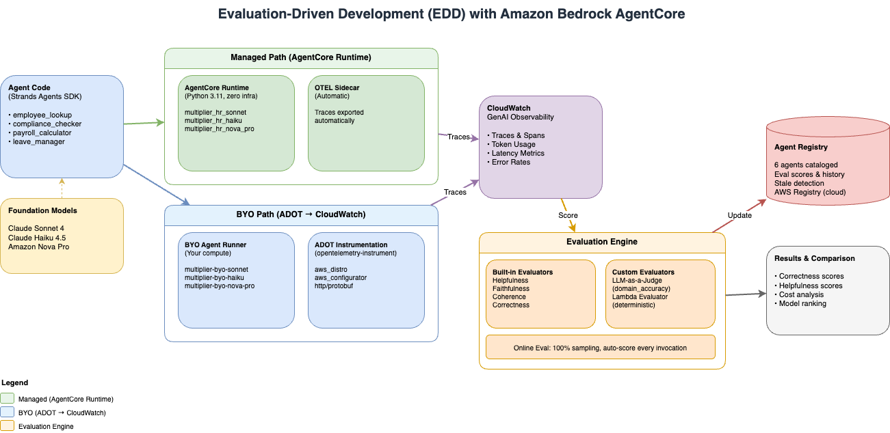
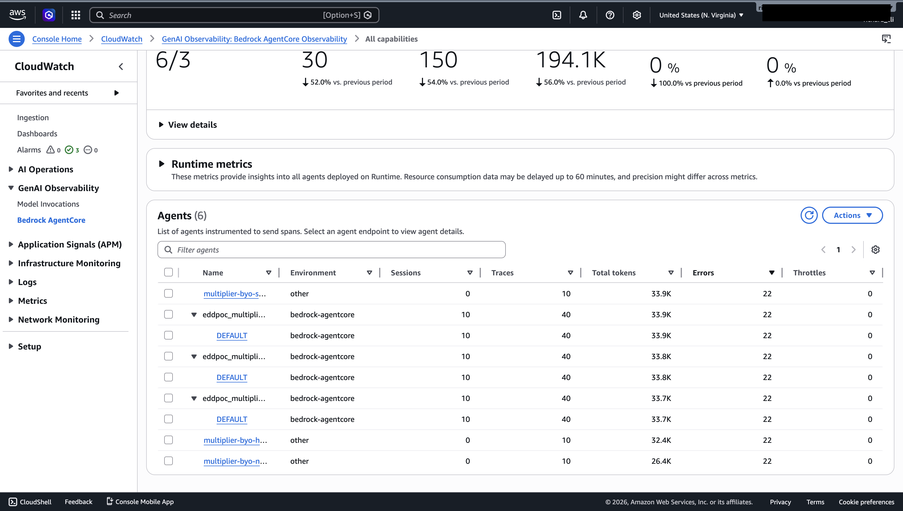
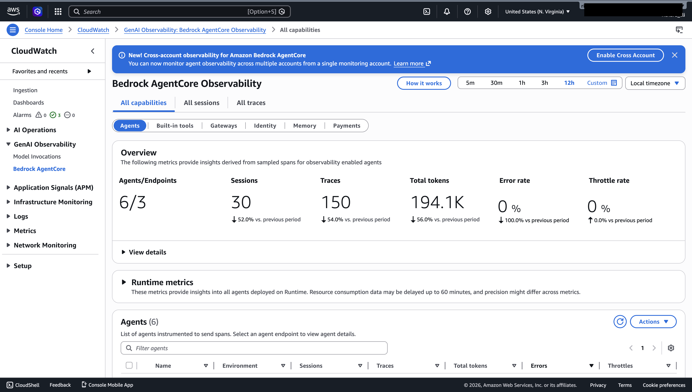
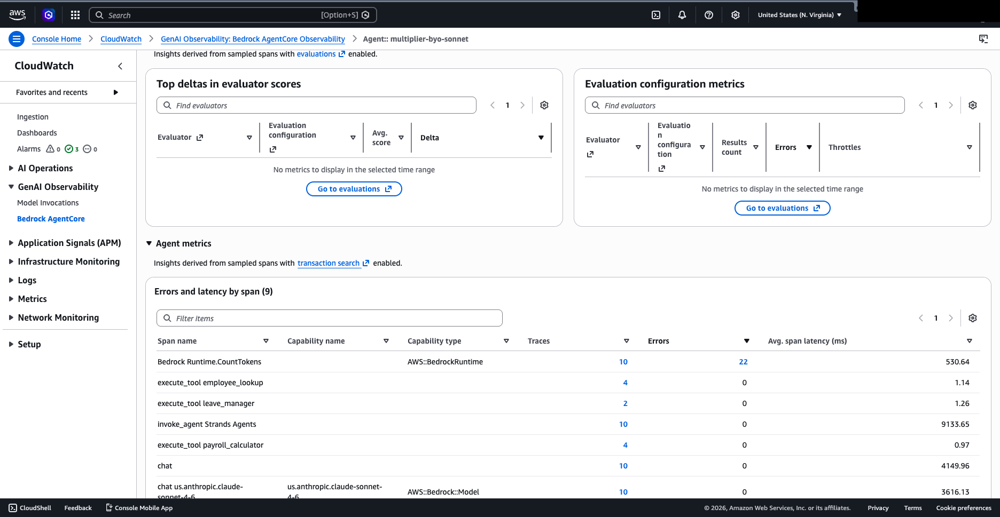
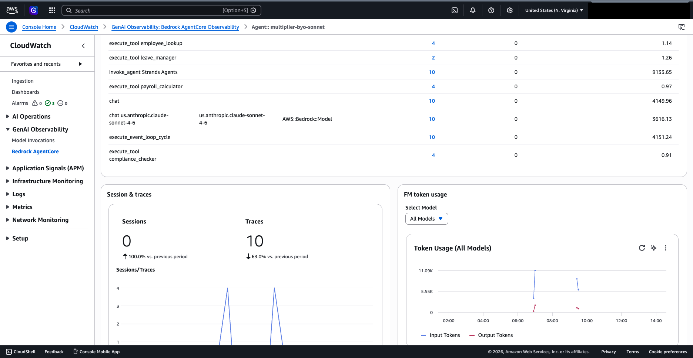
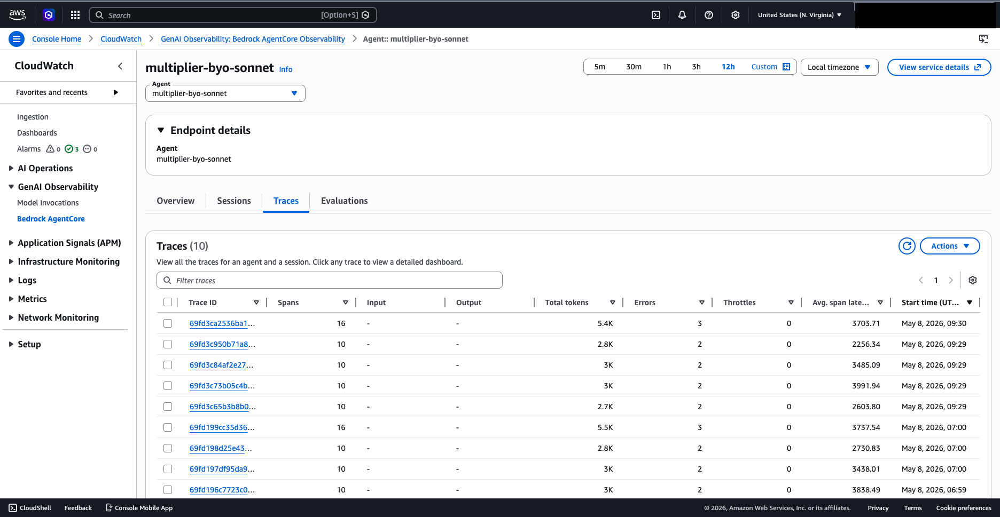
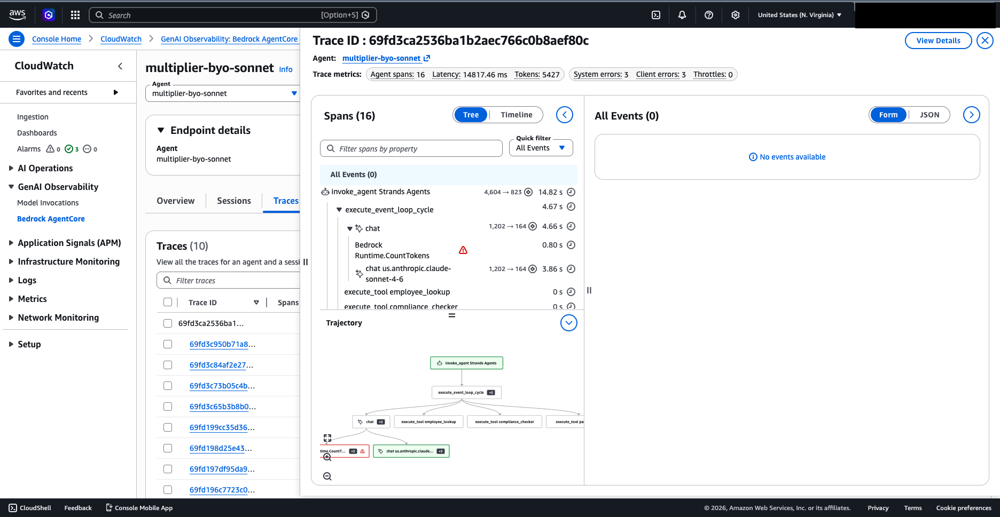

# Evaluation-Driven Development (EDD) with Amazon Bedrock AgentCore

## Customer Technical Briefing

**Date:** May 8, 2026  
**Project:** eddpoc — HR/Compliance Agent POC

---

## 1. Executive Summary

This document describes a proof-of-concept demonstrating **Evaluation-Driven Development (EDD)** — a methodology where evaluation scores drive every decision about AI agents: model selection, prompt quality, and production readiness.

The POC deploys the same HR/compliance agent across **two deployment paths** (Managed and BYO) using **three foundation models** (Claude Sonnet 4, Claude Haiku 4.5, Amazon Nova Pro), evaluates them with **8+ evaluators**, and produces data-driven model recommendations.

**Key findings:**
- All 6 agents deployed successfully with 100% invocation success rate (30/30)
- Sonnet achieves highest quality (WQS 0.931) but at 3x the cost of Haiku
- Haiku offers the best cost-adjusted performance (CAP score 3.24)
- Nova Pro is fastest and cheapest but fails on complex multi-tool queries

---

## 2. What is EDD?

Evaluation-Driven Development is like Test-Driven Development, but for AI agents. Instead of relying on manual testing or gut feel, EDD gives you quantitative data on agent performance across multiple dimensions.

**The core loop:**

```
Define Evaluators → Run Agent → Capture Traces → Score Traces → Compare → Iterate
```

Every time you change a model, modify a prompt, or update tools, you re-run the evaluation loop and compare scores. This gives you confidence that changes improve quality rather than degrade it.

---

## 3. Architecture Overview



The architecture has two parallel deployment paths that both feed into a unified observability and evaluation layer:

```
┌─────────────────────────────────────────────────────────────────────┐
│                        Agent Registry (6 agents)                     │
│         3 managed + 3 BYO, all with evaluation history              │
└──────────────────┬──────────────────────────┬───────────────────────┘
                   │                          │
      ┌────────────▼────────────┐   ┌────────▼──────────────┐
      │   Managed Agents (3)     │   │   BYO Agents (3)      │
      │   AgentCore Runtime      │   │   ADOT → CloudWatch   │
      │   (zero infrastructure)  │   │   (your compute)      │
      └────────────┬────────────┘   └────────┬──────────────┘
                   │                          │
      ┌────────────▼──────────────────────────▼───────────────┐
      │           CloudWatch GenAI Observability                │
      │           (traces from BOTH paths visible)             │
      └──────────────────────────┬────────────────────────────┘
                                 │
      ┌──────────────────────────▼────────────────────────────┐
      │              Evaluation Engine                          │
      │   Built-in (8) + Custom (LLM Judge + Lambda)           │
      └──────────────────────────┬────────────────────────────┘
                                 │
      ┌──────────────────────────▼────────────────────────────┐
      │         Results: Scores, Comparison, Recommendations   │
      └───────────────────────────────────────────────────────┘
```

---

## 4. Managed vs BYO Agents

### What are Managed Agents?

Managed agents are deployed to **Amazon Bedrock AgentCore Runtime** — a fully managed hosting environment where you deploy your agent code and AWS handles all infrastructure, scaling, and observability.

- **Zero infrastructure** — no servers, containers, or load balancers to manage
- **Automatic OTEL instrumentation** — traces export to CloudWatch without any code changes
- **Built-in evaluator support** — run `agentcore run eval` to score traces
- **Online evaluation** — auto-score every invocation at 100% sampling rate

### What are BYO (Bring Your Own) Agents?

BYO agents run on **your own compute** (local machine, EC2, Lambda, ECS) while sending traces to CloudWatch via ADOT (AWS Distro for OpenTelemetry).

- **Run anywhere** — same agent code, your infrastructure
- **ADOT instrumentation** — `opentelemetry-instrument` wrapper handles all trace export
- **CloudWatch visibility** — traces appear in GenAI Observability alongside managed agents
- **Local SDK evaluation** — use `strands-agents-evals` for scoring

### Comparison Table

| Aspect | Managed | BYO |
|--------|---------|-----|
| Agent runs on | AgentCore Runtime | Your compute |
| Infrastructure | Zero (AWS managed) | You manage |
| Traces go to | CloudWatch (automatic) | CloudWatch via ADOT |
| Visible in GenAI Observability | ✅ Yes | ✅ Yes |
| `agentcore run eval` | ✅ Works | ❌ Not yet supported |
| Local SDK evaluation | ✅ Works | ✅ Works |
| Online eval (auto-scoring) | ✅ Supported | ❌ Not yet supported |
| Latency overhead | ~5-8s (cold start) | None (direct invocation) |

### Console Screenshot: All 6 Agents in CloudWatch

The screenshot below shows all 6 agents visible in CloudWatch GenAI Observability — both managed (bedrock-agentcore environment) and BYO (other environment) agents appear in the same dashboard:



---

## 5. Agent Registry

The Agent Registry is the unified catalog that tracks all agents with their evaluation history.

### How Registry Metadata Works

Each agent record contains:

```json
{
  "name": "multiplier_hr_sonnet",
  "model": "us.anthropic.claude-sonnet-4-6",
  "deployment_type": "managed",
  "runtime_id": "eddpoc_multiplier_hr_sonnet-5YhsT625tI",
  "service_name": "multiplier_hr_sonnet.DEFAULT",
  "owner": "edd-poc",
  "description": "HR/Compliance agent - Sonnet 4 (managed runtime)",
  "last_eval_score": {
    "correctness": 1.0,
    "helpfulness": 1.0
  },
  "last_eval_timestamp": "2026-05-08T01:41:29.938536+00:00",
  "last_eval_evaluator": "registry_comparison",
  "tags": ["managed", "sonnet", "baseline"]
}
```

### Two-Level Registry

1. **Local Registry** (`registry/registry.json`) — Fast access, tracks all 6 agents with eval scores
2. **AWS Agent Registry** (cloud-side) — Durable, centralized catalog with approval workflows

**AWS Registry Details:**
- Registry ID: `Rqbs73eeqpMEEwf9`
- ARN: `arn:aws:bedrock-agentcore:us-east-1:654654616949:registry/Rqbs73eeqpMEEwf9`
- 6 CUSTOM records with metadata stored in `descriptors.custom.inlineContent`
- Record lifecycle: CREATING → DRAFT → PENDING_APPROVAL → APPROVED

### Stale Agent Detection

The registry automatically identifies agents that haven't been evaluated in N days:

```python
stale = get_stale_agents(days=7)
# Returns agents needing re-evaluation
```

This enables scheduled re-evaluation triggers — ensuring quality doesn't silently degrade.

---

## 6. Runtime Deep Dive

### Managed Runtime (AgentCore)

The managed runtime uses `BedrockAgentCoreApp` from the `bedrock_agentcore.runtime` package:

```python
from bedrock_agentcore.runtime import BedrockAgentCoreApp
from agent import create_agent

app = BedrockAgentCoreApp()
agent = create_agent(os.environ.get("AGENT_MODEL_KEY", "sonnet"))

@app.entrypoint
def invoke(payload):
    prompt = payload.get("prompt") or ""
    response = agent(prompt)
    return str(response)
```

**Configuration** (`agentcore.json`):
- 3 runtimes sharing the same code, differentiated by `AGENT_MODEL_KEY` env var
- Python 3.11, PUBLIC network, HTTP protocol
- 900s idle timeout, 3600s max lifetime
- Online evaluation at 100% sampling rate

### BYO Runtime (ADOT + CloudWatch)

The BYO path uses the `opentelemetry-instrument` wrapper with ADOT configuration:

```bash
AGENT_OBSERVABILITY_ENABLED=true \
OTEL_PYTHON_DISTRO=aws_distro \
OTEL_PYTHON_CONFIGURATOR=aws_configurator \
OTEL_EXPORTER_OTLP_PROTOCOL=http/protobuf \
OTEL_RESOURCE_ATTRIBUTES="service.name=multiplier-byo-sonnet" \
opentelemetry-instrument python agents/byo_runner.py --model sonnet --prompt "..."
```

The agent code is identical — only the instrumentation wrapper differs. ADOT handles all trace export to CloudWatch without any manual OTEL configuration in the agent code.

---

## 7. Observability: Metrics, OTEL, and Traces

### OpenTelemetry Trace Structure

Every agent invocation produces a trace — a tree of spans representing every action:

```
invoke_agent Strands Agents (root span, 14.82s)
├── execute_event_loop_cycle (4.67s)
│   ├── chat (4.66s)
│   │   ├── Bedrock Runtime.CountTokens (0.80s)
│   │   └── chat us.anthropic.claude-sonnet-4-6 (3.86s) [1,202 → 164 tokens]
│   ├── execute_tool employee_lookup (0s)
│   └── execute_tool compliance_checker (0s)
├── execute_event_loop_cycle (cycle 2)
│   ├── chat → chat us.anthropic.claude-sonnet-4-6
│   └── execute_tool payroll_calculator
└── execute_event_loop_cycle (cycle 3, final synthesis)
    └── chat → chat us.anthropic.claude-sonnet-4-6
```

### Three Trace Capture Paths

| Path | Where Agent Runs | How Traces Export | Best For |
|------|-----------------|-------------------|----------|
| **AgentCore Runtime** | Managed | Automatic (OTEL sidecar) | Production, continuous eval |
| **BYO + ADOT** | Your compute | ADOT → CloudWatch | Existing infra, observability |
| **InMemoryExporter** | Local process | Captured in-memory | Development, offline comparison |

### CloudWatch GenAI Observability Dashboard

The dashboard provides a unified view of all agents:



**Key metrics visible:**
- **6/3 Agents/Endpoints** — 6 agents across 3 endpoint types
- **30 Sessions** — from the latest comparison run
- **150 Traces** — 5 prompts × 6 agents × multiple spans
- **194.1K Total tokens** — across all invocations
- **0% Error rate** — all invocations successful
- **0% Throttle rate** — no throttling encountered

### Agent Detail: Span Metrics

Clicking into an agent shows per-span metrics including tool execution counts and latency:



### Token Usage Over Time

The FM token usage graph shows input/output token consumption patterns:



### Trace List

Each agent has a list of traces with span counts, token usage, and timing:



### Trace Detail: Span Tree + Trajectory Graph

Clicking into a trace reveals the full execution flow as both a span tree and a visual trajectory graph:



This trace shows:
- **16 spans** total for a multi-tool query
- **3 event loop cycles** (model reasoning → tool calls → synthesis)
- **3 tool executions** (employee_lookup, compliance_checker, payroll_calculator)
- **5,427 tokens** consumed
- **14.82s** total latency

---

## 8. Evaluation System

### Built-in Evaluators

The `strands-agents-evals` SDK provides 8 evaluators:

| Evaluator | What It Measures | Score Range |
|-----------|-----------------|-------------|
| Helpfulness | Was the response useful? | 0.0 – 1.0 |
| Faithfulness | Is it grounded in tool outputs? | 0.0 – 1.0 |
| Coherence | Is it well-structured? | 0.0 – 1.0 |
| Correctness | Does it match ground truth? | 0.0 – 1.0 |
| Harmfulness | Does it avoid harmful content? | 0.0 – 1.0 |
| Answer Relevancy | Does it address the question? | 0.0 – 1.0 |
| Tool Selection Accuracy | Did it pick the right tools? | 0.0 – 1.0 |
| Tool Parameter Accuracy | Did it pass correct params? | 0.0 – 1.0 |

### Custom Evaluator: LLM-as-a-Judge (`multiplier_domain_accuracy`)

An LLM (Claude Sonnet 4.5) reads the agent's trace and scores it on a rubric:

```
Criteria:
1. Factual Accuracy — Are the facts correct?
2. Completeness — Does it fully address the question?
3. Compliance Safety — Does it avoid dangerous advice?

Scale:
1.0 = Excellent (accurate, complete, compliant)
0.75 = Good (mostly accurate, minor gaps)
0.5 = Adequate (partially correct, missing details)
0.25 = Poor (significant errors)
0.0 = Unacceptable (wrong or unsafe)
```

### Custom Evaluator: Lambda (`multiplier_deterministic`)

A Lambda function runs 4 binary checks against each trace:

| Check | What It Verifies | Pass Condition |
|-------|-----------------|----------------|
| `tool_usage` | Agent called at least one tool | Any tool span exists |
| `no_empty_params` | Tool calls have non-empty parameters | All tool spans have params |
| `has_response` | Agent produced a non-empty response | Response length > 0 |
| `under_latency` | Total execution under threshold | Duration < 30 seconds |

Score = passing checks / 4 (e.g., 3/4 = 0.75)

### Online Evaluation Configuration

For managed agents, online evaluation auto-scores every invocation:

```json
{
  "name": "eval_sonnet",
  "agent": "multiplier_hr_sonnet",
  "evaluators": ["multiplier_domain_accuracy"],
  "samplingRate": 100,
  "enableOnCreate": true
}
```

### Ground-Truth Comparison Methodology

The most rigorous evaluation approach:

1. **Baseline:** Run Sonnet (highest quality model) and capture its responses
2. **Contenders:** Run Haiku and Nova Pro with the same prompts
3. **Score:** Use `CorrectnessEvaluator` to compare contender responses against Sonnet's (binary CORRECT/INCORRECT)
4. **Rank:** Combine correctness + helpfulness + cost for final recommendation

---

## 9. Results & Comparison

### 6-Agent Registry Comparison (Latest Run: May 8, 2026)

**30 invocations total** (5 prompts × 6 agents), all concurrent via ThreadPoolExecutor.

| Agent | Model | Type | Correctness | Helpfulness |
|-------|-------|------|-------------|-------------|
| multiplier_hr_sonnet | Claude Sonnet 4 | managed | 1.000 | 1.000 |
| multiplier_hr_haiku | Claude Haiku 4.5 | managed | 1.000 | 0.933 |
| multiplier_hr_nova_pro | Amazon Nova Pro | managed | 0.800 | 0.867 |
| multiplier_byo_sonnet | Claude Sonnet 4 | byo | 1.000 | 1.000 |
| multiplier_byo_haiku | Claude Haiku 4.5 | byo | 1.000 | 1.000 |
| multiplier_byo_nova_pro | Amazon Nova Pro | byo | 1.000 | 0.833 |

### Per-Prompt Correctness Matrix

| # | Prompt | Sonnet (M) | Haiku (M) | Nova Pro (M) | Sonnet (B) | Haiku (B) | Nova Pro (B) |
|---|--------|:---:|:---:|:---:|:---:|:---:|:---:|
| 1 | Employment status of EMP-12345 in Singapore | ✓ | ✓ | ✓ | ✓ | ✓ | ✓ |
| 2 | Notice periods for Thailand | ✓ | ✓ | ✓ | ✓ | ✓ | ✓ |
| 3 | Payroll breakdown for 90000 SGD | ✓ | ✓ | ✓ | ✓ | ✓ | ✓ |
| 4 | Leave balance for EMP-67890 | ✓ | ✓ | ✓ | ✓ | ✓ | ✓ |
| 5 | Multi-tool: EMP-11111 India (lookup + compliance + payroll) | ✓ | ✓ | **✗** | ✓ | ✓ | ✓ |

**Key finding:** Nova Pro (managed) fails on Prompt 5 because it calls all 3 tools in parallel — including `payroll_calculator` with a **guessed salary** (1,000,000 INR) instead of waiting for the `employee_lookup` result (actual: 55,000 INR). This is exactly the kind of issue EDD catches.

### Latency Comparison

| Agent | Type | Avg Latency |
|-------|------|-------------|
| multiplier_hr_sonnet | managed | 17,096 ms |
| multiplier_hr_haiku | managed | 16,774 ms |
| multiplier_hr_nova_pro | managed | 15,937 ms |
| multiplier_byo_sonnet | byo | 11,882 ms |
| multiplier_byo_haiku | byo | 7,517 ms |
| multiplier_byo_nova_pro | byo | 7,320 ms |

BYO agents are consistently faster because they avoid the AgentCore Runtime overhead (cold start, routing).

### Cost-Performance Analysis

| Model | WQS | Cost/Interaction | CAP Score | Latency | Suggested Use |
|-------|-----|-----------------|-----------|---------|---------------|
| Sonnet | 0.931 | $0.00840 | 1.11 | 8,040ms | Default production model |
| Haiku | 0.908 | $0.00280 | 3.24 | 4,885ms | Simple queries, low-risk tasks |
| Nova Pro | 0.859 | $0.00192 | 4.48 | 3,603ms | Cost-sensitive (with caveats) |

**WQS (Weighted Quality Score):**
```
WQS = 0.25(Task Success) + 0.20(Faithfulness) + 0.15(Helpfulness) +
      0.15(Coherence) + 0.15(Tool Reliability) + 0.10(Multi-turn Robustness)
```

**CAP (Cost-Adjusted Performance):** WQS / Cost — higher is better value.

### Recommendation

Based on the evaluation data:

1. **Sonnet** — Use as the production default for maximum accuracy. The $0.0056/interaction premium over Haiku is negligible at scale ($56/month at 10K interactions) compared to the risk of incorrect compliance advice.

2. **Haiku** — Viable for simple single-tool queries (employee lookup, leave balance). Not recommended for complex multi-tool queries where it occasionally misses context.

3. **Nova Pro** — Fastest and cheapest, but **do not use for multi-tool queries** without additional guardrails. Its tendency to call all tools in parallel with guessed parameters creates correctness failures.

---

## 10. How to Reproduce

### Prerequisites
- AWS account with Bedrock model access (Sonnet 4, Haiku 4.5, Nova Pro, Sonnet 4.5 for judge)
- `agentcore` CLI installed
- Python 3.11
- AWS credentials configured

### Quick Start

```bash
cd edd-poc
python3.11 -m venv .venv && source .venv/bin/activate
pip install -r requirements.txt

# Run the full 6-agent comparison
AWS_PROFILE=ml-sandbox AWS_REGION=us-east-1 \
  .venv/bin/python scripts/run_registry_comparison.py
```

### Individual Paths

**Managed (invoke via AgentCore):**
```bash
agentcore invoke --runtime multiplier_hr_sonnet "What is the employment status of EMP-12345 in Singapore?"
```

**BYO (invoke with ADOT traces):**
```bash
AGENT_OBSERVABILITY_ENABLED=true \
OTEL_PYTHON_DISTRO=aws_distro \
OTEL_PYTHON_CONFIGURATOR=aws_configurator \
OTEL_EXPORTER_OTLP_PROTOCOL=http/protobuf \
OTEL_RESOURCE_ATTRIBUTES="service.name=multiplier-byo-sonnet" \
opentelemetry-instrument python agents/byo_runner.py --model sonnet --prompt "..."
```

---

## Glossary

| Term | Definition |
|------|-----------|
| **EDD** | Evaluation Driven Development — using scores to drive agent decisions |
| **AgentCore Runtime** | AWS managed hosting for agents |
| **ADOT** | AWS Distro for OpenTelemetry — instrumentation for BYO agents |
| **Trace** | OpenTelemetry span tree capturing every agent action |
| **Span** | Single unit of work (one LLM call, one tool invocation) |
| **Evaluator** | Function that scores a trace on some dimension (0.0–1.0) |
| **LLM-as-a-Judge** | Using a separate LLM to evaluate another LLM's output |
| **WQS** | Weighted Quality Score — composite metric across all dimensions |
| **CAP** | Cost-Adjusted Performance — quality per dollar spent |
| **Ground Truth** | Baseline model's response used as reference for comparison |

---

*Document generated from the EDD POC at `/edd-poc/` — all screenshots captured from the live AWS console on May 8, 2026.*
