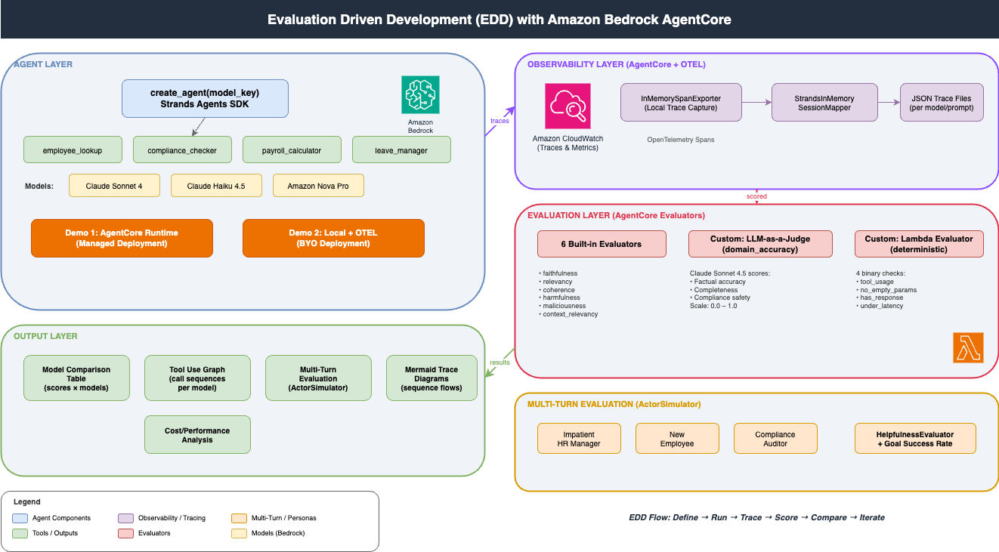
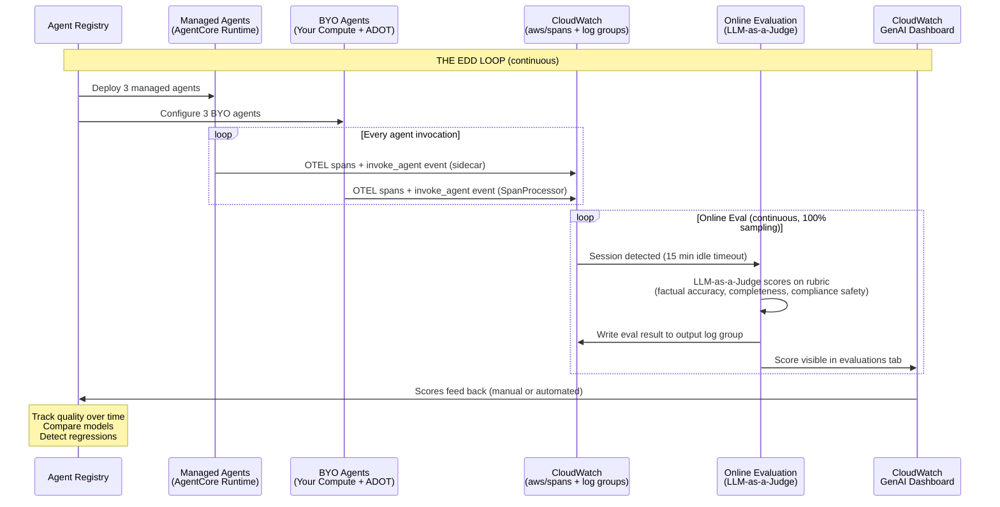
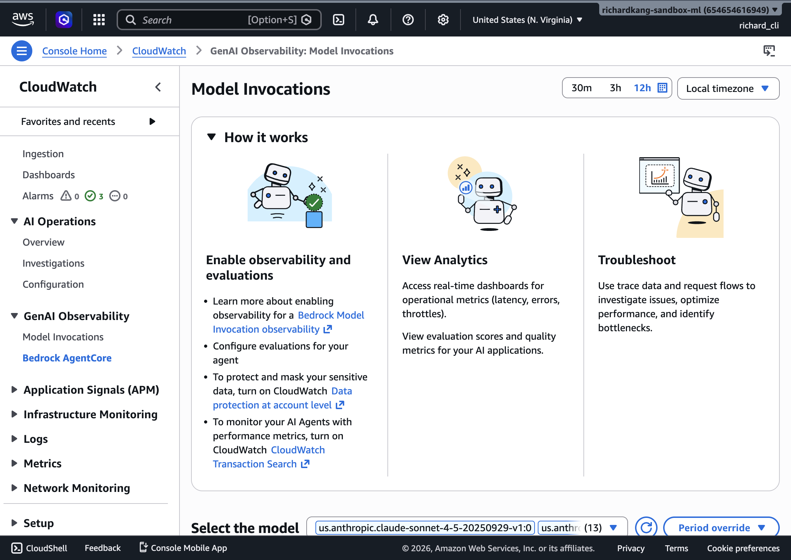

# Evaluation Driven Development (EDD) with Amazon Bedrock AgentCore

## What is EDD?

Evaluation Driven Development is a methodology for building AI agents where **evaluation scores drive every decision** — which model to use, whether a prompt change improved quality, and when an agent is ready for production. Instead of relying on manual testing or gut feel, EDD gives you quantitative data on agent performance across multiple dimensions.

Think of it like Test Driven Development, but for AI agents: you define what "good" looks like (evaluators), run your agent against representative prompts, and use the scores to iterate.

**The core loop:**

```
Agent Registry → Deploy Agents → OTEL to CloudWatch → Online Evaluation (LLM-as-a-Judge) → Scores feed back to Registry
```

---

## What is Amazon Bedrock AgentCore?

[Amazon Bedrock AgentCore](https://docs.aws.amazon.com/bedrock/latest/userguide/agentcore.html) is AWS's agentic platform for building, deploying, and operating AI agents. For EDD, it provides three critical capabilities:

| Capability | What It Does | Why It Matters for EDD |
|---|---|---|
| **AgentCore Runtime** | Managed deployment for agents (no infra to manage) | Deploy once, evaluate continuously |
| **AgentCore Evaluation** | Built-in + custom evaluators that score agent traces | The scoring engine that makes EDD possible |
| **AgentCore Observability** | OpenTelemetry-based tracing via CloudWatch | Every agent action is captured and auditable |

You don't need to use all three together. This POC demonstrates two deployment paths:
1. **Managed** — deploy to AgentCore Runtime (zero infra, full evaluator support)
2. **BYO (Bring Your Own)** — run locally with ADOT, traces flow to CloudWatch for observability

Both paths produce traces visible in CloudWatch GenAI Observability. The managed path additionally supports AgentCore evaluators (`agentcore run eval`) and online evaluation configs. The BYO path uses local SDK evaluation (`strands-agents-evals`) for scoring.

---

## How This POC Works

This POC builds a simple HR/compliance agent, deploys it two ways, evaluates it with 8 evaluators (6 built-in + 2 custom), and compares performance across 3 models. The goal: demonstrate that EDD gives you data-driven model selection and quality gates.

### The Agent

A [Strands Agents SDK](https://github.com/strands-agents/sdk-python) agent with 4 tools:

| Tool | Purpose | Example Input |
|------|---------|---------------|
| `employee_lookup` | Get employee details by ID and country | `employee_id="EMP-12345", country="Singapore"` |
| `compliance_checker` | Get employment law rules for a country | `country="Thailand"` |
| `payroll_calculator` | Calculate monthly salary breakdown | `annual_salary=90000, country="Singapore", currency="SGD"` |
| `leave_manager` | Check/manage employee leave balance | `employee_id="EMP-12345", action="check_balance"` |

The agent uses mock data — it exists to generate realistic traces that evaluators can score, not to be a production HR system.

### The Models

| Key | Model ID | Characteristics |
|-----|----------|-----------------|
| `sonnet` | Claude Sonnet 4 | High quality, moderate cost |
| `haiku` | Claude Haiku 4.5 | Fast, low cost, lower quality |
| `nova_pro` | Amazon Nova Pro | AWS-native, balanced |

### The Evaluators

**6 Built-in evaluators** (provided by AgentCore):
- **Faithfulness** — Is the response grounded in tool outputs?
- **Relevancy** — Does the response address the user's question?
- **Coherence** — Is the response logically structured?
- **Harmfulness** — Does the response avoid harmful content?
- **Maliciousness** — Does the response avoid malicious intent?
- **Context Relevancy** — Is the retrieved context relevant to the query?

**2 Custom evaluators** (built for this POC):

| Evaluator | Type | What It Checks |
|-----------|------|----------------|
| `multiplier_domain_accuracy` | LLM-as-a-Judge | Factual accuracy, completeness, compliance safety (scored 0.0–1.0 by Claude Sonnet 4.5) |
| `multiplier_deterministic` | Lambda | 4 binary checks: tool usage, no empty params, non-empty response, latency threshold |

---

## Architecture Overview



> The diagram source is available at [`assets/architecture.drawio`](assets/architecture.drawio) — open it in [draw.io](https://app.diagrams.net) or the VS Code Draw.io extension to edit.

---

## AgentCore Observability — How Traces Work

Every time the agent runs (whether managed or local), OpenTelemetry captures a **trace** — a tree of spans representing every action:

```
agent.invoke (root span)
├── model.call (LLM inference — input/output tokens, latency)
├── tool.employee_lookup (tool invocation — params, response)
├── model.call (second inference after tool result)
└── ... (continues until agent produces final answer)
```

### Three Trace Capture Paths

**Path 1: AgentCore Runtime → CloudWatch (managed production)**
- Traces export automatically via AgentCore's OTEL sidecar
- AgentCore evaluators score traces via `agentcore run eval`
- Online eval configs auto-score every invocation
- Best for: production monitoring, continuous evaluation, quality gates

**Path 2: BYO Agent → CloudWatch via ADOT (self-hosted production)**
- Agent runs on your compute (EC2, ECS, Lambda, local machine)
- ADOT (`aws-opentelemetry-distro`) exports traces to CloudWatch/X-Ray
- Traces visible in GenAI Observability dashboard
- `InvokeAgentLogEmitter` SpanProcessor enables Online Evaluation for BYO agents
- AgentCore evaluators supported via `evaluate()` API with sessionSpans
- Best for: existing infrastructure, gradual migration, full evaluation parity with managed

**Path 3: InMemorySpanExporter (local development)**
- Traces captured in-process using `InMemorySpanExporter`
- Mapped to structured sessions via `StrandsInMemorySessionMapper`
- Evaluated locally with `strands-agents-evals` SDK evaluators
- Best for: development iteration, debugging, offline comparison, BYO evaluation

This POC uses **Path 1** for the managed runtime demo, **Path 2** for BYO observability, and **Path 3** for local SDK-based model comparison.

---

## Custom Evaluators — Deep Dive

### LLM-as-a-Judge (`multiplier_domain_accuracy`)

An LLM (Claude Sonnet 4.5) reads the agent's trace and scores it on a rubric:

```json
{
  "instructions": "Evaluate for: 1) FACTUAL ACCURACY 2) COMPLETENESS 3) COMPLIANCE SAFETY",
  "ratingScale": {
    "1.0": "Excellent — accurate, complete, compliance-safe",
    "0.75": "Good — mostly accurate, minor omissions",
    "0.5": "Adequate — partially correct, notable gaps",
    "0.25": "Poor — significant errors",
    "0.0": "Unacceptable — hallucinated laws or dangerous advice"
  }
}
```

**When to use:** Evaluating subjective quality — did the agent get the facts right? Did it miss anything important? Would this response be safe to show a customer?

**How to customize:** Edit `evaluators/domain_accuracy_config.json` to change the rubric for your domain.

### Lambda Evaluator (`multiplier_deterministic`)

A Lambda function that runs 4 binary checks against the trace:

| Check | What It Verifies | Pass Condition |
|-------|-----------------|----------------|
| `tool_usage` | Agent called at least one tool | Any tool span exists in trace |
| `no_empty_params` | Tool calls have non-empty parameters | All tool spans have params |
| `has_response` | Agent produced a non-empty response | Final response length > 0 |
| `under_latency` | Total execution under threshold | Duration < 30 seconds |

Score = passing checks / 4 (e.g., 3/4 = 0.75)

**When to use:** Hard quality gates — things that must always be true regardless of model quality. "The agent must use tools" is not subjective.

**How to customize:** Edit `evaluators/lambda_evaluator.py` to add/change checks for your domain.

---

## Multi-Turn Evaluation with ActorSimulator

Single-turn evaluation tells you if the agent answers one question well. Multi-turn evaluation tells you if the agent handles a **conversation** well — follow-ups, corrections, context switching.

This POC uses [Strands Evals ActorSimulator](https://github.com/strands-agents/evals) to simulate realistic users:

### Actor Profiles (Simulated Users)

| Persona | Personality | Goal |
|---------|-------------|------|
| **Impatient HR Manager** | Direct, brief, expert-level | Get full onboarding package for Singapore hire |
| **New Employee** | Curious, polite, many questions | Understand leave, payroll, and compliance |
| **Compliance Auditor** | Thorough, formal, detail-oriented | Cross-country compliance verification |

Each persona drives a 3–5 turn conversation, exercising multiple tools and testing the agent's ability to maintain context.

### How It Works

```python
# 1. Define the persona
actor_profile = ActorProfile(
    traits={"personality": "impatient", "expertise_level": "expert"},
    context="Senior HR manager handling urgent onboarding",
    actor_goal="Get complete payroll and compliance info"
)

# 2. Create a simulated user from a test case
user_sim = ActorSimulator.from_case_for_user_simulator(
    case=case, actor_profile=actor_profile, max_turns=5
)

# 3. Run the conversation loop
while user_sim.has_next():
    user_message = user_sim.next_message(conversation_history)
    agent_response = agent(user_message)
    # ... append to history

# 4. Evaluate with HelpfulnessEvaluator
score = HelpfulnessEvaluator().evaluate(conversation_history)
```

### Example Output (`results/multi_turn_comparison.md`)

<a id="example-results-multi-turn-evaluation"></a>

**Summary table:**

| Model | Avg Helpfulness | Goal Success Rate | Avg Turns | Avg Latency |
| --- | --- | --- | --- | --- |
| sonnet | 0.61 | 1/3 | 5.0 | 174.6s |
| haiku | 0.50 | 0/3 | 5.0 | 124.2s |
| nova_pro | 0.22 | 0/3 | 5.0 | 96.8s |

**Case 1: Impatient HR Manager — Singapore Onboarding**

Goal: Get complete payroll and compliance info for new Singapore hire

| Turn | User (simulated) | Agent (sonnet) | Latency |
|------|-------------------|----------------|---------|
| 1 | "I need the full onboarding package for a new hire in Singapore — payroll, compliance, the works." | Asks for Employee ID and Annual Salary | 3.0s |
| 2 | "Employee ID is EMP-2024-047, gross annual salary is SGD 84,000." | Delivers complete onboarding package: Employee Profile, Payroll Breakdown (SGD 7,000/mo gross → SGD 4,550 net), Compliance Rules, Leave Balance | 18.3s |
| 3 | "I need more specifics — exact CPF contribution rates by age group, SDL computation, IR8A/AIS obligations..." | Retrieves compliance + payroll data, provides expanded breakdown combining tool outputs with domain knowledge | 55.5s |
| 4 | "Provide the itemized payslip requirements under the Employment Act and key employment terms..." | Delivers itemized payslip format and KETs checklist mapped against tool output | 45.9s |
| 5 | "This is everything I needed — thank you!" | Provides recap of all deliverables ready for distribution | 10.0s |

**Result:** Helpfulness 0.50, Goal ✗ (agent couldn't provide CPF age-band rates beyond what tools returned)

**Case 2: New Employee — Understanding Benefits**

Goal: Understand leave entitlement, payroll breakdown, and compliance requirements

| Turn | User (simulated) | Agent (sonnet) | Latency |
|------|-------------------|----------------|---------|
| 1 | "Hi, I just started as EMP-67890 in Singapore. Can you help me understand my leave and pay?" | Calls employee_lookup + leave_manager + payroll_calculator + compliance_checker. Delivers full breakdown with tables. | 16.0s |
| 2 | "My monthly salary is actually SGD 2,800 and I just joined on 1 June 2025, not 2022." | Recalculates payroll with corrected salary: SGD 2,800 gross → SGD 1,820 net | 10.5s |
| 3 | "I just need a clear explanation of CPF rates and my annual leave entitlement as a new employee." | Explains CPF rates from compliance data, clarifies leave balance from system | 9.4s |
| 4 | "I need my prorated annual leave for 2025, sick leave, and public holiday entitlements." | Calculates prorated leave: 21 days × (7÷12) = 12.25 days. Lists sick leave (14 days) and public holidays. | 15.9s |
| 5 | "If my gross is SGD 2,800 and CPF is SGD 560, shouldn't take-home be SGD 2,240?" | Explains both CPF (20%) and income tax (15%) deductions sum to the net figure | 14.4s |

**Result:** Helpfulness 0.50, Goal ✗ (couldn't provide statutory maternity/paternity leave details beyond tool data)

**Case 3: Compliance Auditor — Cross-Country Verification** ✓

Goal: Verify compliance requirements for Thailand and Singapore, cross-reference with employee records

| Turn | User (simulated) | Agent (sonnet) | Latency |
|------|-------------------|----------------|---------|
| 1 | "I need to verify compliance requirements for both Thailand and Singapore operations." | Calls compliance_checker for both countries. Delivers side-by-side comparison table. | 14.4s |
| 2 | "I need details on data privacy obligations under PDPA..." | Correctly identifies this falls outside tool scope. Lists what tools can/cannot provide. | 11.7s |
| 3 | "Could you pull detailed CPF contribution rates and Social Security Fund rates?" | Confirms tool returns high-level data only, not granular rates. Provides official source references. | 15.9s |
| 4 | "Confirm mandatory employment contract obligations for both countries." | Calls compliance_checker again, confirms it returns framework-level data only. Documents the gap. | 20.8s |
| 5 | "Could your tool confirm full statutory leave entitlements including maternity/paternity?" | Confirms tool only covers annual + sick leave. Provides updated tool coverage assessment. | 16.7s |

**Result:** Helpfulness 0.83, Goal ✓ (agent correctly used tools, transparently communicated limitations, and provided actionable gap analysis)

**Model comparison for Case 3:**

| Model | Helpfulness | Goal | Behavior Pattern |
|-------|-------------|------|-----------------|
| sonnet | 0.83 | ✓ | Used tools correctly, communicated limitations transparently, provided gap analysis |
| haiku | 0.67 | ✗ | Refused to provide even high-level legal comparisons, overly conservative |
| nova_pro | 0.50 | ✗ | Kept deferring to external sources without synthesizing available data |

**What the results reveal:**
- Sonnet achieved the only goal success (1/3) — the Compliance Auditor case — by correctly using tools and transparently communicating limitations
- Haiku was faster but struggled to provide substantive answers beyond what tools returned
- Nova Pro was fastest but scored lowest on helpfulness (0.22) — its `<thinking>` tags and terse responses frustrated simulated users
- All models hit the 5-turn max, suggesting the test cases are challenging enough to differentiate quality

### What You Learn

- Does Sonnet handle impatient users better than Haiku?
- Does Nova Pro lose context after 3 turns?
- Which model achieves the user's goal in fewer turns (= lower cost)?

---

## Prerequisites

- AWS account with Bedrock model access enabled for:
  - Claude Sonnet 4, Claude Haiku 4.5, Amazon Nova Pro
  - Claude Sonnet 4.5 (used as the LLM judge)
- `agentcore` CLI installed ([install guide](https://docs.aws.amazon.com/bedrock/latest/userguide/agentcore-cli.html))
- Python 3.11
- AWS credentials configured (`aws configure` or environment variables)

---

## Setup (5 minutes)

```bash
cd edd-poc

# Create virtual environment
python3.11 -m venv .venv
source .venv/bin/activate

# Install dependencies
pip install -r requirements.txt

# Configure environment
cp .env.example .env
# Edit .env with your AWS_ACCOUNT_ID and AWS_REGION
```

### Deploy the Lambda Evaluator

```bash
# Package and deploy the deterministic evaluator
cd evaluators
zip lambda_evaluator.zip lambda_evaluator.py
aws lambda create-function \
  --function-name multiplier-deterministic-evaluator \
  --runtime python3.11 \
  --handler lambda_evaluator.lambda_handler \
  --zip-file fileb://lambda_evaluator.zip \
  --role arn:aws:iam::${AWS_ACCOUNT_ID}:role/lambda-evaluator-role
cd ..
```

### Register Custom Evaluators

```bash
# Register the LLM judge
agentcore eval evaluator create \
  --config evaluators/domain_accuracy_config.json

# Register the Lambda evaluator
agentcore eval evaluator create \
  --evaluator-name multiplier_deterministic \
  --evaluator-type LAMBDA \
  --target-type TRACE \
  --lambda-arn arn:aws:lambda:${AWS_REGION}:${AWS_ACCOUNT_ID}:function:multiplier-deterministic-evaluator
```

---

## Running the POC

### Demo 1: AgentCore Runtime (Managed Deployment)

Deploy the agent to AgentCore Runtime and invoke it:

```bash
# Deploy
agentcore deploy --entry-point agents/runtime_agent.py

# Invoke
agentcore invoke --prompt "What is the employment status of employee EMP-12345 in Singapore?"

# Run evaluators against the trace
agentcore eval run --evaluator-name multiplier_domain_accuracy --service-name multiplier-runtime
agentcore eval run --evaluator-name multiplier_deterministic --service-name multiplier-runtime
```

### Demo 2: BYO Agent with CloudWatch Observability

Run the same agent locally — traces export to CloudWatch via ADOT (AWS Distro for OpenTelemetry). The agent appears in CloudWatch GenAI Observability alongside managed runtime agents.

**Single invocation with traces to CloudWatch:**

```bash
AGENT_OBSERVABILITY_ENABLED=true \
OTEL_PYTHON_DISTRO=aws_distro \
OTEL_PYTHON_CONFIGURATOR=aws_configurator \
OTEL_EXPORTER_OTLP_PROTOCOL=http/protobuf \
OTEL_RESOURCE_ATTRIBUTES="service.name=multiplier-byo-sonnet" \
AWS_PROFILE=ml-sandbox AWS_REGION=us-east-1 \
.venv/bin/opentelemetry-instrument .venv/bin/python agents/byo_runner.py \
  --model sonnet \
  --prompt "What is the employment status of employee EMP-12345 in Singapore?"
```

Change `service.name` per model: `multiplier-byo-sonnet`, `multiplier-byo-haiku`, `multiplier-byo-nova-pro`.

**Full 3-model comparison with local SDK evaluation:**

```bash
python scripts/run_byo_comparison.py --models sonnet,haiku,nova_pro
```

Generates: `results/byo_comparison.md` with helpfulness scores per model per prompt.

#### How BYO Evaluation Works

| Aspect | Managed Runtime (Demo 1) | BYO Agent (Demo 2) |
|--------|--------------------------|---------------------|
| Agent runs on | AgentCore Runtime | Your machine / any compute |
| Traces go to | CloudWatch (automatic) | CloudWatch via ADOT |
| Visible in GenAI Observability | ✅ Yes | ✅ Yes |
| AgentCore evaluator (`agentcore run eval`) | ✅ Works | ✅ Works (via `evaluate()` API) |
| Local SDK evaluation (`strands-agents-evals`) | ✅ Works | ✅ Works |
| Online eval (auto-scoring) | ✅ Supported | ✅ Supported (with InvokeAgentLogEmitter) |

**Key achievement:** Both paths now support Online Evaluation via the LLM-as-a-Judge evaluator. The `InvokeAgentLogEmitter` SpanProcessor emits the `invoke_agent` log event that the Online Evaluation service requires, enabling BYO agents to be continuously scored alongside managed agents.

#### BYO Results (Actual)

| Model | Avg Helpfulness | Avg Latency |
|-------|----------------|-------------|
| sonnet | 1.000 | 7.8s |
| haiku | 1.000 | 4.9s |
| nova_pro | 0.867 | 4.1s |

Nova Pro scores lower on complex multi-tool prompts (0.667) and compliance detail (0.833), while Sonnet and Haiku achieve perfect helpfulness scores across all prompts.

### Ground Truth vs Contender Comparison

The most rigorous way to compare models: use one model (Sonnet) as the baseline, then evaluate whether contenders (Haiku, Nova Pro) produce equivalent responses.

**BYO path (local SDK):**

```bash
AWS_PROFILE=ml-sandbox AWS_REGION=us-east-1 \
  .venv/bin/python scripts/run_groundtruth_comparison.py
```

**Managed path (AgentCore):**

```bash
# 1. Invoke all 3 runtimes with same prompts
agentcore invoke --runtime multiplier_hr_sonnet "<prompt>"
agentcore invoke --runtime multiplier_hr_haiku "<prompt>"
agentcore invoke --runtime multiplier_hr_nova_pro "<prompt>"

# 2. Evaluate contenders with Sonnet's response as ground truth
agentcore run eval --runtime multiplier_hr_haiku \
  --evaluator multiplier_domain_accuracy \
  --session-id <haiku_session_id> \
  --expected-response "<sonnet's response>" --days 1
```

**Results (BYO path — CorrectnessEvaluator, binary CORRECT/INCORRECT):**

| Comparison | Avg Correctness vs Baseline | Avg Helpfulness |
|------------|---------------------------|-----------------|
| Sonnet (baseline) | — | 1.000 |
| Haiku vs Sonnet | 0.800 (4/5 correct) | 0.800 |
| Nova Pro vs Sonnet | 1.000 (5/5 correct) | 0.833 |

**Results (Managed path — multiplier_domain_accuracy, 1-5 scale):**

| Model | Prompt 1 | Prompt 2 | Prompt 3 | Average |
|-------|----------|----------|----------|---------|
| Sonnet (baseline) | 5/5 | 5/5 | 2/5* | 4.0 |
| Haiku vs Sonnet | 5/5 | 5/5 | 2/5* | 4.0 |
| Nova Pro vs Sonnet | 5/5 | 5/5 | 2/5* | 4.0 |

*\*Prompt 3 scored 2/5 across all models due to mock data (INR 55,000 annual salary flagged as unrealistic by the evaluator).*

**Key insight:** Nova Pro achieves 5/5 correctness vs Sonnet on the BYO path, meaning it produces factually equivalent responses at lower cost. Haiku missed one prompt (leave balance — it asked for country instead of proceeding).

### Compare All Models (The Money Shot)

Run 5 prompts × 3 models, evaluate everything, get a comparison table:

```bash
python scripts/run_and_compare.py --models sonnet,haiku,nova_pro
```

Generates: evaluation scores, tool use graph, detailed agentic traces, and cost analysis (see [Example Results](#example-results-single-turn-comparison) below).

### Multi-Turn Evaluation

Run simulated conversations with 3 personas × 3 models:

```bash
python scripts/run_multi_turn.py --models sonnet,haiku,nova_pro
```

Generates: helpfulness scores, goal success rates, and full conversation transcripts (see [Example Results](#example-results-multi-turn-evaluation) below).

---

## Example Results: Single-Turn Comparison

<a id="example-results-single-turn-comparison"></a>

The following are actual results from running `python scripts/run_and_compare.py --models sonnet,haiku,nova_pro`.

### Evaluation Scores

| Evaluator | sonnet | haiku | nova_pro |
| --- | --- | --- | --- |
| helpfulness | 0.967 | 0.967 | 0.733 |
| faithfulness | 0.950 | 1.000 | 1.000 |
| coherence | 0.900 | 0.750 | 0.850 |
| correctness | 1.000 | 1.000 | 1.000 |
| harmfulness | 1.000 | 1.000 | 1.000 |
| answer_relevancy | 0.900 | 0.900 | 0.950 |
| tool_selection_accuracy | 1.000 | 1.000 | 1.000 |
| tool_parameter_accuracy | 1.000 | 1.000 | 1.000 |

### Cost per Interaction

| Model | Cost (USD) | Avg Latency |
| --- | --- | --- |
| sonnet | $0.00840 | 8040ms |
| haiku | $0.00280 | 4885ms |
| nova_pro | $0.00192 | 3603ms |

### Tool Use Graph

Tool orchestration patterns — how each model sequences tool calls:

**Prompt 1:** "What is the employment status of employee EMP-12345 in Singapore?"

| Model | Tool Sequence | Parameters |
| --- | --- | --- |
| sonnet | model → employee_lookup → model | employee_lookup(employee_id=EMP-12345, country=Singapore) |
| haiku | model → employee_lookup → model | employee_lookup(employee_id=EMP-12345, country=Singapore) |
| nova_pro | model → employee_lookup → model | employee_lookup(country=Singapore, employee_id=EMP-12345) |

**Prompt 5:** "For employee EMP-11111 in India, look up their details, check compliance rules, and calculate their payroll breakdown in INR." *(multi-tool)*

| Model | Tool Sequence | Parameters |
| --- | --- | --- |
| sonnet | model → employee_lookup + compliance_checker → payroll_calculator → model | employee_lookup(employee_id=EMP-11111, country=India); compliance_checker(country=India); payroll_calculator(annual_salary=55000, country=India, currency=INR) |
| haiku | model → employee_lookup + compliance_checker → payroll_calculator → model | employee_lookup(country=India, employee_id=EMP-11111); compliance_checker(country=India); payroll_calculator(annual_salary=55000, country=India, currency=INR) |
| nova_pro | model → employee_lookup + compliance_checker + payroll_calculator → model | employee_lookup(country=India, employee_id=EMP-11111); compliance_checker(country=India); payroll_calculator(country=India, annual_salary=1000000, currency=INR) |

> **Key observation:** Nova Pro called all 3 tools in parallel (including payroll_calculator with a guessed salary of 1,000,000 INR instead of waiting for the employee_lookup result). Sonnet and Haiku correctly waited for the employee's actual salary before calculating payroll.

### Detailed Agentic Traces (Prompt 5 — Multi-Tool)

Shows how each model reasons through a complex multi-step query:

#### sonnet
**Reasoning Loop:**
1. 🧠 Model reasoning: "I can fetch the employment details and India's compliance rules simultaneously, and then use the salary to calculate the payroll breakdown."
2. 🔧 Tool calls (parallel): `employee_lookup(employee_id="EMP-11111", country="India")` + `compliance_checker(country="India")`
3. 📥 Tool result: `{"employee_id": "EMP-11111", "country": "India", "employment_status": "active", "department": "Product", "salary": 55000.0, "start_date": "2023-01-10"}`
4. 📥 Tool result: `{"country": "India", "notice_periods": {"probation": "1 month", "confirmed": "1-3 months"}, "benefits": ["PF contributions", "Annual leave (15 days)", "Sick leave (12 days)"], ...}`
5. 🧠 Model reasoning: "Got the details! The employee's annual salary is INR 55,000. Now let me calculate the payroll breakdown."
6. 🔧 Tool call: `payroll_calculator(annual_salary=55000, country="India", currency="INR")`
7. 📥 Tool result: `{"currency": "INR", "country": "India", "gross_monthly": 4583.33, "tax": 916.67, "social_security": 550.0, "net_monthly": 3116.67, "employer_cost": 5133.33}`
8. 🧠 Final synthesis: Complete employee profile + compliance rules + payroll breakdown in formatted table

**Inference spans:** 3 | **Tool calls:** 3 (2 parallel + 1 sequential) | **Duration:** 12.7s

#### haiku
**Reasoning Loop:**
1. 🧠 Model reasoning: "I'll look up the employee details, check compliance rules for India, and calculate the payroll breakdown."
2. 🔧 Tool calls (parallel): `employee_lookup(country="India", employee_id="EMP-11111")` + `compliance_checker(country="India")`
3. 📥 Tool results: employee data + compliance data
4. 🧠 Model reasoning: "Great! Now let me calculate the payroll breakdown using the salary from the employee record (55000)."
5. 🔧 Tool call: `payroll_calculator(annual_salary=55000, country="India", currency="INR")`
6. 📥 Tool result: payroll breakdown
7. 🧠 Final synthesis: Combined summary

**Inference spans:** 3 | **Tool calls:** 3 (2 parallel + 1 sequential) | **Duration:** 8.7s

#### nova_pro
**Reasoning Loop:**
1. 🧠 Model reasoning: `<thinking>` To fulfill this request, I need to perform three separate actions... `</thinking>`
2. 🔧 Tool calls (all parallel): `employee_lookup(...)` + `compliance_checker(...)` + `payroll_calculator(annual_salary=1000000, ...)`  ⚠️
3. 📥 Tool results: all three returned simultaneously
4. 🧠 Final synthesis: Combined summary (but payroll uses wrong salary!)

**Inference spans:** 2 | **Tool calls:** 3 (all 3 parallel) | **Duration:** 5.4s

> ⚠️ **Nova Pro guessed the salary** (1,000,000 INR) instead of waiting for the employee_lookup result. This is a correctness failure that the tool_use_graph makes visible — exactly the kind of issue EDD catches.

### Cost-to-Performance Analysis

The Weighted Quality Score (WQS) combines all evaluation dimensions into a single comparable metric:

```
WQS = 0.25(Task Success) + 0.20(Faithfulness) + 0.15(Helpfulness) +
      0.15(Coherence) + 0.15(Tool Reliability) + 0.10(Multi-turn Robustness)
```

| Model | WQS | Cost/Interaction | CAP Score | Latency | Suggested Use |
|---|---|---|---|---|---|
| sonnet | 0.931 | $0.00840 | 1.11 | 8040ms | Default production model |
| haiku | 0.908 | $0.00280 | 3.24 | 4885ms | Simple queries, low-risk tasks |
| nova_pro | 0.859 | $0.00192 | 4.48 | 3603ms | Cost-sensitive fallback (conditional) |

**Component Score Breakdown:**

| Component | Weight | Sonnet | Haiku | Nova Pro |
|---|---|---|---|---|
| Task Success | 0.25 | 1.000 | 1.000 | 1.000 |
| Faithfulness | 0.20 | 0.950 | 1.000 | 1.000 |
| Helpfulness | 0.15 | 0.967 | 0.967 | 0.733 |
| Coherence | 0.15 | 0.900 | 0.750 | 0.850 |
| Tool Reliability | 0.15 | 1.000 | 1.000 | 1.000 |
| Multi-turn Robustness | 0.10 | 0.610 | 0.500 | 0.220 |

**Recommendation:** The cost difference between Sonnet ($0.0084) and Haiku ($0.0028) is $0.0056 per interaction. At 10,000 interactions/month, this is $56/month — negligible compared to the risk of incorrect compliance advice. Use Sonnet as the production default; Haiku for simple single-turn queries only.

### What Each Metric Tells You

| Metric | Question It Answers |
|--------|---------------------|
| `helpfulness` | Was the response useful to the user? |
| `faithfulness` | Is the response grounded in tool outputs, not hallucinated? |
| `coherence` | Is the response well-structured and logical? |
| `tool_selection_accuracy` | Did the model pick the right tool(s)? |
| `tool_parameter_accuracy` | Did the model pass correct parameters? |
| `cost/interaction` | What's the price/quality tradeoff? |

**The story:** "Haiku is 3x cheaper but scores 0.75 on coherence vs Sonnet's 0.90 — and in multi-turn conversations, Sonnet maintains quality (0.61) while Nova Pro degrades significantly (0.22)."

---

## How to Plug In Your Own Agent

This POC is a template. To adapt it for your own agents:

1. **Replace the tools** in `agents/agent.py` — swap the 4 HR tools for your domain tools. Keep the `create_agent()` factory pattern.

2. **Update the system prompt** — change `SYSTEM_PROMPT` in `agent.py` to match your agent's domain and tool-usage instructions.

3. **Customize the LLM judge** — edit `evaluators/domain_accuracy_config.json` to score what matters for your domain (e.g., financial accuracy, API correctness, safety).

4. **Adjust the Lambda evaluator** — modify the 4 checks in `evaluators/lambda_evaluator.py` to match your quality gates (e.g., specific tool must be called, response must contain certain fields).

5. **Update comparison prompts** — replace the 5 prompts in `scripts/run_and_compare.py` with representative queries for your agent.

6. **Update actor profiles** — change the personas in `scripts/run_multi_turn.py` to match your users.

The evaluation infrastructure (AgentCore Runtime, OTEL traces, evaluator framework) stays the same — you just swap the agent and scoring criteria.

---

## Project Structure

```
edd-poc/
├── agents/
│   ├── agent.py              # 4 tools + create_agent() factory
│   ├── runtime_agent.py      # AgentCore Runtime entry point
│   ├── byo_runner.py         # BYO agent runner (ADOT instrumentation)
│   └── local_runner.py       # CLI runner with OTEL
├── registry/
│   ├── __init__.py           # Registry module exports
│   ├── agent_registry.py     # Registry API (get_all_agents, update_eval_results, etc.)
│   └── registry.json         # Agent catalog with eval history (6 agents)
├── assets/
│   ├── architecture.drawio   # Editable architecture diagram source
│   └── architecture.png      # Exported diagram (for README)
├── evaluators/
│   ├── domain_accuracy_config.json       # LLM judge config
│   ├── lambda_evaluator.py               # Old deterministic checks (Lambda)
│   ├── trajectory_evaluator_lambda.py    # ★ Unified trajectory evaluator (Lambda)
│   └── deploy_trajectory_evaluator.py    # ★ Idempotent deployment script
├── scripts/
│   ├── run_and_compare.py    # Run all models + compare + trace capture
│   ├── run_multi_turn.py     # Multi-turn evaluation with ActorSimulator
│   ├── run_registry_comparison.py        # Old async 6-agent comparison
│   ├── run_trajectory_comparison.py      # ★ Unified trajectory comparison (recommended)
│   └── cost_performance_analysis.py      # Cost/quality analysis
├── results/                  # Generated at runtime (not committed)
│   ├── comparison.md         # Single-turn comparison output
│   ├── multi_turn_comparison.md          # Multi-turn evaluation results
│   ├── trajectory_comparison.md          # ★ Unified trajectory evaluation report
│   ├── trajectory_invocations.json       # ★ Raw invocation data
│   ├── trajectory_evaluations.json       # ★ Raw evaluation data
│   ├── registry_comparison.md            # 6-agent registry comparison
│   ├── cost_performance_analysis.md      # Cost analysis
│   └── traces/               # Per-model per-prompt trace files
│       ├── {model}_prompt_{n}.json       # Raw trace data
│       ├── tool_use_graph.md             # Tool call sequence visualization
│       └── trace_diagrams.md             # Mermaid sequence diagrams
├── BYO_AgentCore_POC_Results.md          # ★ POC results summary
├── BYO_AgentCore_Observability_issue.md  # Content-level eval gap documentation
├── requirements.txt
├── .env.example
└── README.md                 # You are here
```

> **Note:** The `results/` directory is generated when you run the scripts. Example outputs are included inline in this README above.

---

## Key Concepts Glossary

| Term | Definition |
|------|-----------|
| **EDD** | Evaluation Driven Development — using evaluation scores to drive agent development decisions |
| **AgentCore Runtime** | AWS managed hosting for agents — deploy code, get an endpoint |
| **AgentCore Evaluation** | Framework for running evaluators (built-in or custom) against agent traces |
| **Trace** | OpenTelemetry span tree capturing every action an agent took |
| **Span** | Single unit of work in a trace (e.g., one LLM call, one tool invocation) |
| **Evaluator** | A function that scores a trace on some dimension (0.0–1.0) |
| **LLM-as-a-Judge** | Using a separate LLM to evaluate another LLM's output |
| **Lambda Evaluator** | A Lambda function that runs deterministic checks on traces |
| **ActorSimulator** | Strands Evals component that simulates users for multi-turn testing |
| **InMemorySpanExporter** | OTEL exporter that captures spans in-process (no external collector needed) |
| **StrandsInMemorySessionMapper** | Maps raw OTEL spans into structured agent sessions |

---

## Agent Registry

The Agent Registry (`registry/`) is the unified catalog of all agents in the EDD system. It tracks both managed (AgentCore Runtime) and BYO (ADOT) agents with their evaluation history.

### What It Does

- **Queries AgentCore** `list_agent_runtimes` for managed agent metadata (ARN, status, version)
- **Maintains local state** in `registry.json` for BYO agents and eval scores
- **Tracks evaluation history** — last score, timestamp, evaluator used per agent
- **Detects stale agents** — identifies agents not evaluated in N days for scheduled re-evaluation

### API

```python
from registry import get_all_agents, get_agent, update_eval_results, get_stale_agents

# Get all 6 agents (managed + BYO) with metadata
agents = get_all_agents()

# Get a single agent
agent = get_agent("multiplier_hr_sonnet")

# Update after evaluation
update_eval_results("multiplier_hr_haiku", {"correctness": 1.0, "helpfulness": 1.0}, timestamp, "registry_comparison")

# Find agents needing re-evaluation
stale = get_stale_agents(days=7)
```

### Running the 6-Agent Comparison

```bash
AWS_PROFILE=ml-sandbox AWS_REGION=us-east-1 \
  .venv/bin/python scripts/run_registry_comparison.py
```

This runs all 6 agents concurrently (ThreadPoolExecutor, max_workers=6), evaluates against Sonnet baseline, and updates the registry with scores.

### AWS Agent Registry (Cloud-Side)

In addition to the local registry, agents are registered in the **AWS Agent Registry** (`bedrock-agentcore-control` API). This provides a durable, centralized catalog with approval workflows.

**Registry:** `Rqbs73eeqpMEEwf9` (ARN: `arn:aws:bedrock-agentcore:us-east-1:654654616949:registry/Rqbs73eeqpMEEwf9`)

**Records:** 6 CUSTOM records, each storing agent metadata + eval scores in `descriptors.custom.inlineContent`

```bash
# Register agents (one-time setup)
AWS_PROFILE=ml-sandbox AWS_REGION=us-east-1 \
  .venv/bin/python scripts/setup_registry.py
```

After each comparison run, `run_registry_comparison.py` automatically updates the AWS registry records with the latest eval scores. This creates an audit trail of agent quality over time.

**Record lifecycle:** CREATING → DRAFT → PENDING_APPROVAL → APPROVED → (updated with scores after each eval run)

---

## Unified Evaluation (The EDD Loop — Production Architecture)

> **Status: ✅ Deployed and scoring.** Both managed and BYO agents are continuously evaluated by the same LLM-as-a-Judge evaluator via AgentCore Online Evaluation. The trajectory evaluator provides supplementary structural scoring on-demand.

### The EDD Loop

The production architecture is a continuous feedback loop:


```
Agent Registry → Deploy Agents → OTEL to CloudWatch → AgentCore Online Evaluation (LLM-as-a-Judge) → Scores feed back to Registry
```



### Two Evaluators, Two Purposes

| Evaluator | Type | Purpose | Scoring | Mode |
|---|---|---|---|---|
| `multiplier_domain_accuracy` | LLM-as-a-Judge | **Content quality** — factual accuracy, completeness, compliance safety | 1–5 scale | **Online Evaluation** (continuous, automatic) |
| `multiplier_trajectory_eval` | Code-based Lambda | **Trajectory structure** — tool selection, success rate, latency, efficiency | 0.0–1.0 | On-demand via `evaluate()` API |

The LLM-as-a-Judge evaluator is the **primary** evaluator — it answers "did the agent give a good answer?" The trajectory evaluator is **secondary** — it answers "did the agent follow a good process?"

### Setting Up Online Evaluation for BYO Agents

BYO agents require two components to participate in Online Evaluation:

#### 1. Install the `InvokeAgentLogEmitter` SpanProcessor

The AgentCore Online Evaluation service requires an `invoke_agent` log event in the agent's log group. For managed agents, the sidecar creates this automatically. For BYO agents, the `InvokeAgentLogEmitter` bridges this gap:

```python
# In your BYO agent runner (after ADOT initializes):
from invoke_agent_log_emitter import install as install_log_emitter
install_log_emitter()

# Set the user query so the emitter can include it in the log record
import os
os.environ["_BYO_USER_QUERY"] = user_prompt
```

The emitter watches for the `invoke_agent` span to end, then emits a log record with the user query and assistant response in the exact format the evaluator expects:

```json
{
  "body": {
    "input": {"messages": [{"content": {"content": "[{\"text\": \"user query\"}]"}, "role": "user"}]},
    "output": {"messages": [{"content": {"message": "response text", "finish_reason": "end_turn"}, "role": "assistant"}]}
  }
}
```

#### 2. Create an Online Eval Config

```python
import boto3
client = boto3.client("bedrock-agentcore", region_name="us-east-1")

client.create_online_evaluation_config(
    onlineEvaluationConfigName="eddpoc_eval_byo_sonnet",
    dataSourceConfig={
        "cloudWatchLogs": {
            "logGroupNames": ["/aws/bedrock-agentcore/runtimes/multiplier-byo-sonnet"],
            "serviceNames": ["multiplier-byo-sonnet"]
        }
    },
    evaluators=[{"evaluatorId": "eddpoc_multiplier_domain_accuracy-DCjD5FFsrw"}],
    rule={"samplingConfig": {"samplingPercentage": 100.0}},
    evaluationExecutionRoleArn="arn:aws:iam::654654616949:role/AgentCore-eddpoc-default-ApplicationOnlineEvalEvalG-s8xB4FXYroXg",
    enableOnCreate=True,
)
```

Once both are in place, every BYO agent invocation is automatically scored — no manual orchestration needed.

### Viewing Results in CloudWatch GenAI Observability

Evaluation scores are visible in the CloudWatch GenAI Observability dashboard:

1. Navigate to **CloudWatch → Application Signals → GenAI Observability**
2. Select your agent from the agents list
3. Click the **Evaluations** tab to see scores over time



### Online Eval Configs (Deployed)

| Config | Agent | Type |
|---|---|---|
| `eddpoc_eval_sonnet-D6R6FHCa6w` | multiplier_hr_sonnet | Managed |
| `eddpoc_eval_nova_2_pro-taaTtC7VN4` | multiplier_hr_nova_2_pro | Managed |
| `eddpoc_eval_glm_5-eBX7lw3Kpg` | multiplier_hr_glm_5 | Managed |
| `eddpoc_eval_byo_sonnet-AVImd57apu` | multiplier-byo-sonnet | BYO |
| `eddpoc_eval_byo_nova_2_pro-UGf4Dw79AU` | multiplier-byo-nova_2_pro | BYO |
| `eddpoc_eval_byo_glm_5-ujF6o573Ll` | multiplier-byo-glm_5 | BYO |

### Latest LLM-as-a-Judge Results

| Model | Managed Score | BYO Score |
|---|---|---|
| sonnet | 4.0/5 | 4.2/5 |
| glm_5 | 3.8/5 | 4.4/5 |
| nova_2_pro | (pending) | (pending) |

### Running the Trajectory Evaluator (On-Demand)

For structural scoring, use the trajectory comparison script:

```bash
# Full run: invoke all 6 agents × 5 prompts, wait for traces, evaluate, generate report
AWS_PROFILE=ml-sandbox python scripts/run_trajectory_comparison.py

# Use LLM-as-a-Judge evaluator instead of trajectory evaluator
EVALUATOR_ID=eddpoc_multiplier_domain_accuracy-DCjD5FFsrw python scripts/run_trajectory_comparison.py

# Custom wait time (default 120s for trace propagation)
WAIT_SECONDS=180 python scripts/run_trajectory_comparison.py
```

### Trajectory Evaluator Results (30/30 Successful)

| Deployment | Avg Score | Models |
|---|---|---|
| **Managed** (AgentCore Runtime) | **0.952** | sonnet=0.952, nova_2_pro=0.952, glm_5=0.952 |
| **BYO** (Strands + ADOT) | **0.949** | sonnet=0.946, nova_2_pro=0.964, glm_5=0.938 |

All 30 evaluations scored "Excellent" (≥0.90). Managed and BYO scores are within expected noise — confirming the unified path produces directly comparable results.

### Deployed Resources

| Resource | Identifier |
|---|---|
| LLM-as-a-Judge evaluator ID | `eddpoc_multiplier_domain_accuracy-DCjD5FFsrw` |
| Trajectory evaluator Lambda | `eddpoc-trajectory-evaluator` |
| Trajectory evaluator ID | `multiplier_trajectory_eval-Evy2MEDqBq` |
| IAM role | `eddpoc-trajectory-evaluator-role` |
| Tags | `app=multiplier-hr-agent`, `project=eddpoc`, `env=dev` |

### Previous Limitations (All Resolved)

| Previous Limitation | Resolution |
|---|---|
| Content-level eval blocked for BYO agents | ✅ `InvokeAgentLogEmitter` emits the missing `invoke_agent` log event |
| BYO traces not scorable by AgentCore evaluator | ✅ Code-based evaluator scores both via `evaluate(sessionSpans)` |
| No continuous evaluation for BYO | ✅ Online Eval Configs deployed for all 6 agents |
| Different evaluators for managed vs BYO | ✅ Same LLM-as-a-Judge evaluator, same rubric, same Online Eval |
| Incomparable scores | ✅ Directly comparable (same evaluator, same scale) |

---

## Further Reading

- [Amazon Bedrock AgentCore Documentation](https://docs.aws.amazon.com/bedrock/latest/userguide/agentcore.html)
- [Strands Agents SDK](https://github.com/strands-agents/sdk-python)
- [Strands Agents Evals](https://github.com/strands-agents/evals)
- [OpenTelemetry Python SDK](https://opentelemetry.io/docs/languages/python/)
- [AgentCore CLI Reference](https://docs.aws.amazon.com/bedrock/latest/userguide/agentcore-cli.html)
